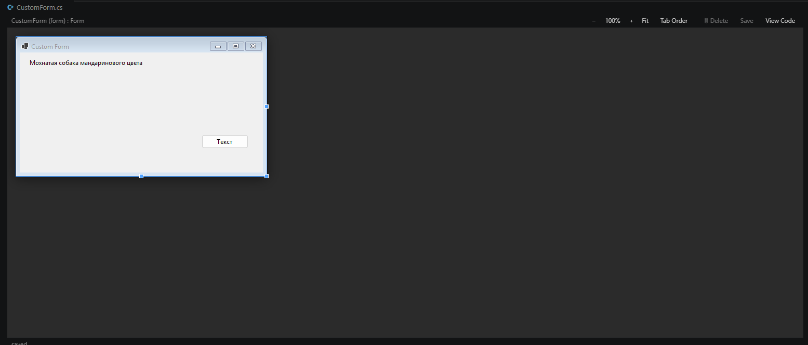
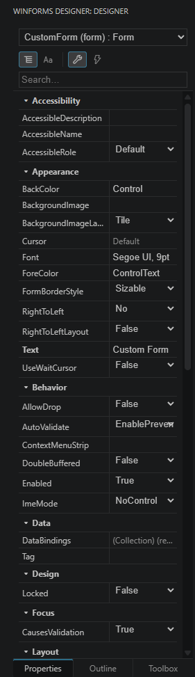
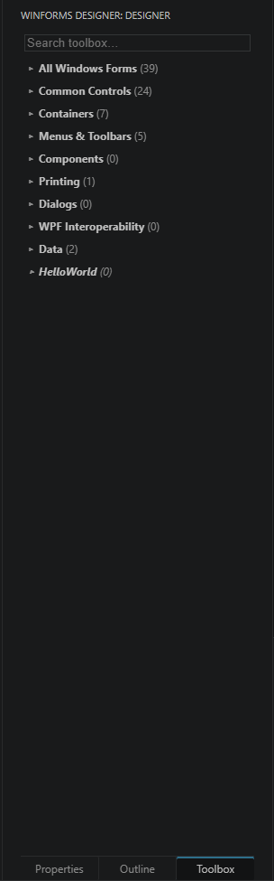
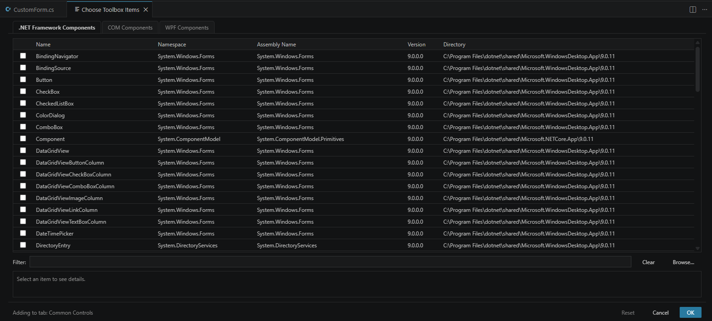

<div align="center">

# WinForms Designer for VS Code

**A Visual Studio–style WinForms form designer, running natively inside VS Code.**

Render, click-select, edit and lay out `.Designer.cs` forms — live — without leaving the editor.

[](https://github.com/SkivHisink/winforms-designer-vscode/actions/workflows/ci.yml)
[](LICENSE)
[](https://code.visualstudio.com/)
[](https://dotnet.microsoft.com/)
[](#-status)

</div>

<div align="center">



</div>

---

## What is this?

VS Code has no native WinForms designer — to draw a `Form` you normally have to open Visual Studio. **WinForms Designer for VS Code** brings that designer surface into VS Code:

- Open a form's `Form1.cs` (with its generated `Form1.Designer.cs` sibling) and a **live preview of the rendered form** appears — exactly as Visual Studio shows the designer.
- **Click any control** to select it; a **property grid** and **toolbox** dock alongside the canvas.
- **Edit properties, drag/resize controls, align, set tab order, wire events** — changes are written back into `.Designer.cs` as **minimal, byte-surgical text edits** (the rest of your file is preserved byte-for-byte).

The rendering is real: a headless .NET host actually instantiates your controls (including custom/3rd-party ones) and paints them with their real `OnPaint`, so the preview matches runtime. Two engines are bundled — a **.NET 9** engine for modern projects and a **.NET Framework 4.8** engine for classic `net4x` / DevExpress projects — and each form is routed to the right one automatically.

## 📸 Screenshots

| Property grid | Toolbox |
| :---: | :---: |
|  |  |

**Choose Toolbox Items** — browse framework and project controls, just like Visual Studio:



> 🎬 _Animated GIFs of the live edit/drag/resize loop are on the way (see [issues](https://github.com/SkivHisink/winforms-designer-vscode/issues))._

## ✨ Features

- **Live form rendering** from `.Designer.cs` — full frame plus fast per-control dirty-region patches.
- **.NET Framework & DevExpress support (experimental)** — `net4x` forms render on a bundled **.NET Framework 4.8** engine that instantiates the compiled controls (so DevExpress `XtraUserControl` & co. look pixel-accurate); the extension auto-routes each form to the right engine, and the property grid, drag/resize/align, add/remove and z-order apply live. _(Cut/paste on this engine is not available yet.)_
- **Visual Studio–style workflow** — opening `Form.cs` opens the designer; *View Code* switches back to text.
- **Property grid** — primitives, enums, and complex types (`Point`, `Size`, `Color`, `Font`, `Padding`, `Rectangle`), composite expansion (`Size → Width/Height`), and standard-value dropdowns. VS-style **Color** (tabbed palette), **Font** (expandable name/size/style), **flags-enum**, **Anchor/Dock**, and **image** editors.
- **Images & `.resx`** — images stored in a form's sibling `.resx` are rendered in the preview; **import** or **clear** `Image` / `BackgroundImage` / `Icon` and the change is written back into both the `.Designer.cs` and the `.resx`.
- **Layout panels** — edit `TableLayoutPanel` cells and column/row styles, `SplitContainer` splitter distance, and `FlowLayoutPanel` order, with anchor tethers drawn on the canvas.
- **Toolbox** — auto-populated from `System.Windows.Forms` (~39 controls in VS categories, with their native icons) plus controls discovered from your project. **Choose Toolbox Items** to browse framework / project / other assemblies. Add controls to the surface.
- **Control sources** — pick which project (`.csproj`) or assembly (`.dll`) supplies your custom / 3rd-party controls; dropping a control from an unreferenced assembly offers to add the project reference.
- **Direct manipulation** — select, move, resize (8 handles), multi-select (Ctrl/Shift + rubber-band), group move/delete, reparent, z-order, copy/paste, align + distribute + make-same-size, tab-order editor, snaplines, and a VS-style right-click menu.
- **Events** — describe, wire / unwire / rewire handlers, generate a handler stub, and navigate to the handler body in the `.cs` partner.
- **Component tray** & **document outline** (ARIA-accessible) for non-visual components and the control hierarchy.
- **Safe save** — edits are applied as targeted text splices guarded by representability and statement-diff gates; everything outside the changed span is preserved exactly (encoding/BOM included).
- **Zero-config assembly resolution** — finds your build output via MSBuild design-time evaluation (with multi-target support), or set an explicit assembly path.
- **Export Diagnostics** command for easy bug reports.

## 🏗️ Architecture

```
  Form1.cs  ─────────────┐
  Form1.Designer.cs ─────┤
                         ▼
        ┌────────────────────────────────────────────────┐
        │  Engine host — routed per form:                │
        │  • .NET 9 engine (C#)                          │
        │      Roslyn parse → safe interpret →           │  render • describe • edit
        │      WinForms host → DrawToBitmap              │
        │  • .NET Framework 4.8 engine (C#)              │
        │      instantiate compiled net4x / DevExpress   │  (experimental)
        │      controls → DrawToBitmap                   │
        └────────────────────────────────────────────────┘
                         ▲  JSON-RPC over a named pipe
                         │  (StreamJsonRpc, camelCase DTOs)
                         ▼
        ┌───────────────────────────────────┐
        │  VS Code extension (TypeScript)   │
        │  custom editor + dockable panel   │
        └───────────────────────────────────┘
                         ▲
                         │ postMessage
                         ▼
        ┌───────────────────────────────────┐
        │  Webview (canvas preview +        │
        │  property grid / toolbox / tree)  │
        └───────────────────────────────────┘
```

| Part | Folder | Tech |
|------|--------|------|
| Rendering / editing engine (.NET 9) | [`engine/`](engine/) | C# · .NET 9 (`net9.0-windows`) · WinForms · Roslyn · StreamJsonRpc |
| .NET Framework engine (experimental) | [`engine-net48/`](engine-net48/) | C# · .NET Framework 4.8 (`net48`) · WinForms · compiled-control render · StreamJsonRpc |
| VS Code extension | [`extension/`](extension/) | TypeScript · esbuild · VS Code Custom Editor API |
| Webview UI | [`extension/media/`](extension/media/) | Plain JS (canvas + DOM) |
| Sample forms / fixtures | [`engine/samples/`](engine/samples/), [`samples/`](samples/) | `.Designer.cs` forms |

## 📦 Requirements

- **Windows** — WinForms is Windows-only, so both engines and the rendered preview require Windows.
- **[.NET 9 SDK](https://dotnet.microsoft.com/download)** (`net9.0-windows`) to build and run the primary engine.
- **.NET Framework 4.8** — for rendering `net4x` / DevExpress projects. The runtime ships with Windows; building the `engine-net48/` engine from source needs the .NET Framework 4.8 targeting pack.
- **VS Code** `^1.84`.
- A **trusted workspace** — see [Security](#-security--workspace-trust).

## 🚀 Installing

Install from the **VS Code Marketplace** — search for **“WinForms Designer”**, or open the [Marketplace listing](https://marketplace.visualstudio.com/items?itemName=SkivHisink.winforms-designer-vscode).

> The extension is in **preview** — expect rough edges. It requires **Windows** and the **.NET 9 SDK** (see [Requirements](#-requirements)).

### Build & run from source

```bash
# 1. Build the .NET engine
dotnet build engine -c Release

# 2. Build the extension
cd extension
npm ci
npm run build
```

Then open the `extension/` folder in VS Code and press **F5**. A *Extension Development Host* opens on the `engine/samples` folder with all other extensions disabled. Open **`SampleForm.cs`** to see the designer.

See **[CONTRIBUTING.md](CONTRIBUTING.md)** for the full dev loop, tests, and architecture notes.

## 🧭 Usage

1. Open a form's **`Form1.cs`** (it must have a sibling generated **`Form1.Designer.cs`**). The designer opens automatically — like Visual Studio.
   - You can also right-click a `.cs` file → **Reopen Editor With… → WinForms Designer**.
2. **Click a control** on the canvas to select it. Use the **Properties** panel to edit values, or drag/resize directly.
3. Drop new controls from the **Toolbox**.
4. Press **F4** to focus the Properties panel; use **View Code** to switch back to the text editor.
5. **Save** (the toolbar Save button / `Ctrl+S`) writes minimal edits back into `.Designer.cs`.

### Settings

| Setting | Default | Description |
|---------|---------|-------------|
| `winformsDesigner.autoOpenDesigner` | `true` | Open the designer automatically when a form's `.cs` becomes active. |
| `winformsDesigner.assemblyPath` | `""` | Explicit path to the built control assembly. Leave empty for auto-discovery; set it for multi-target / custom `OutputPath` / not-yet-built projects. |

## 🔒 Security & Workspace Trust

Rendering a designer **loads and runs your project's control assemblies** — control constructors and `OnPaint` execute when the preview is built. For that reason:

- The extension is **disabled in untrusted workspaces** (Workspace Trust).
- The engine **interprets `.Designer.cs` through strict allowlists** (only known-safe constructors, static calls, and property reads) — it does not execute arbitrary code from the file.

Only open projects you trust. To report a vulnerability, see **[SECURITY.md](SECURITY.md)**.

## 🗺️ Status

This project is in **active preview**.

- ✅ **Done & verified:** the core render → select → edit → save loop; property grid (incl. Color / Font / flags / Anchor-Dock / image editors); toolbox with icons and *Choose Toolbox Items*; control-source selection; direct manipulation (move / resize / reparent / z-order / copy-paste / align / snaplines); layout-panel editing (`TableLayoutPanel` / `SplitContainer` / `FlowLayoutPanel`); `.resx` image import & render; events; safe save; accessibility mirror-tree.
- 🧪 **Experimental (new in 0.3.0):** **.NET Framework (net48) compiled preview** for `net4x` / DevExpress forms — render is proven; live property / drag / resize / align / add / remove / z-order edits are wired (persisted as `.Designer.cs` text via the .NET 9 splice) but not yet covered by automated tests. Cut/paste on this engine is not available yet.
- 🚧 **In progress:** `UITypeEditor` / collection-editor modals, richer multi-assembly control sources, and further VS-parity polish.
- 🔭 **Not started:** smart-tags / `DesignerActionList`, advanced `.resx` (non-image resources, `ApplyResources`), localization / RTL.

The webview UI is primarily validated headless; some interactions are best confirmed with a live run. Expect rough edges and please [file issues](https://github.com/SkivHisink/winforms-designer-vscode/issues).

## 🤝 Contributing

Contributions are very welcome! Start with **[CONTRIBUTING.md](CONTRIBUTING.md)** — it covers the repo layout, build/test commands, the F5 dev loop, and the **security gates that must not be weakened**. Please also read the **[Code of Conduct](CODE_OF_CONDUCT.md)**.

- 🐛 Found a bug? Use the **Bug report** issue template (the **WinForms: Export Designer Diagnostics** command produces a ready-to-paste report).
- 💡 Have an idea? Open a **Feature request**.

## 📄 License

[MIT](LICENSE) © 2026 SkivHisink
