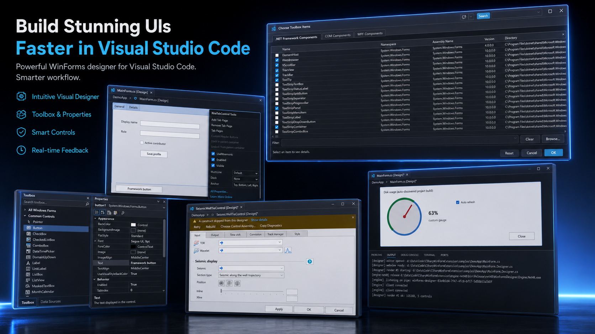
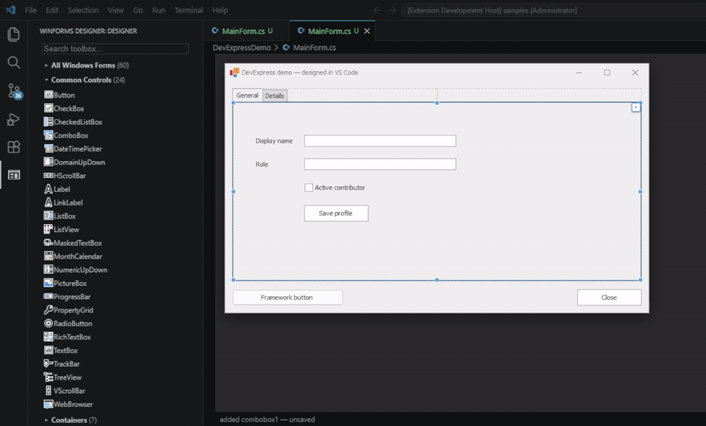
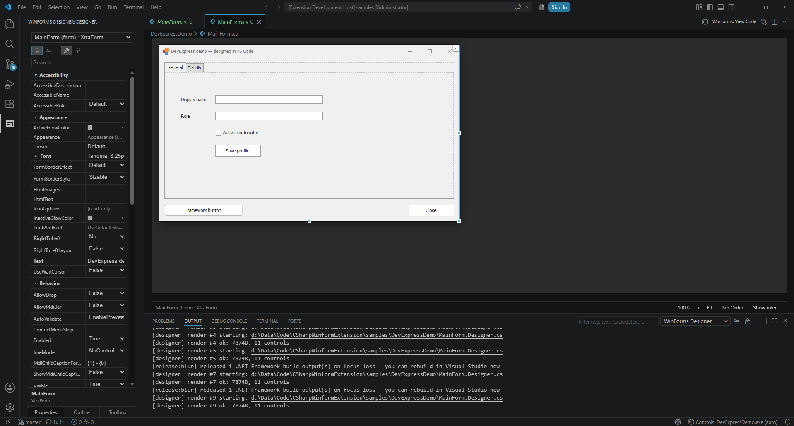
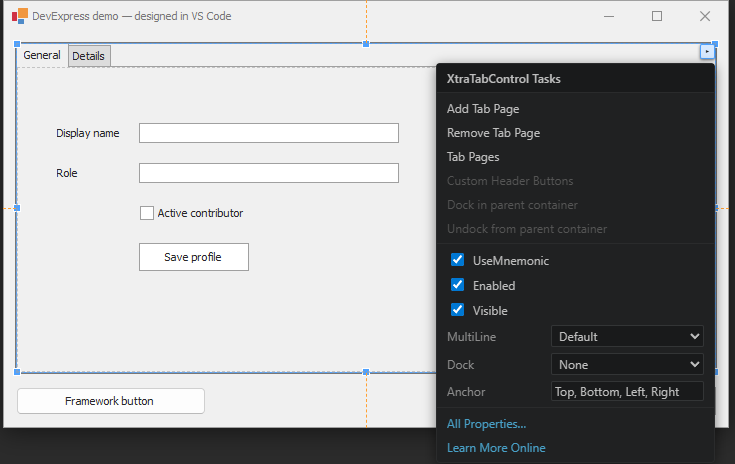
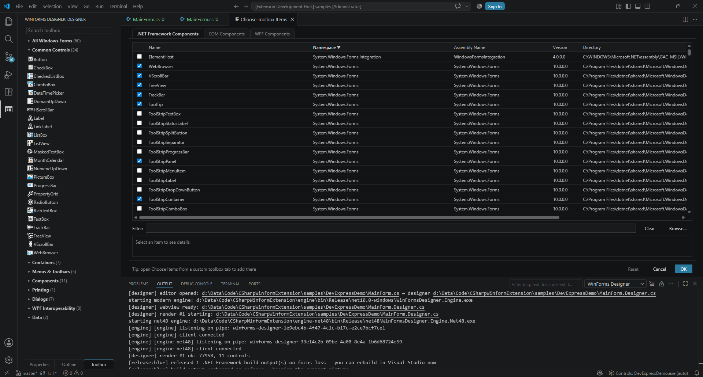
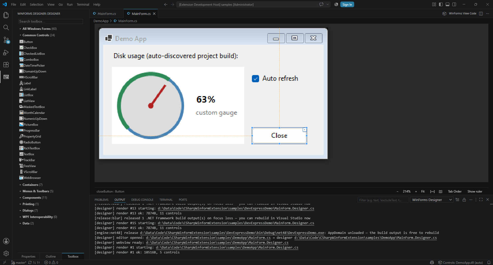
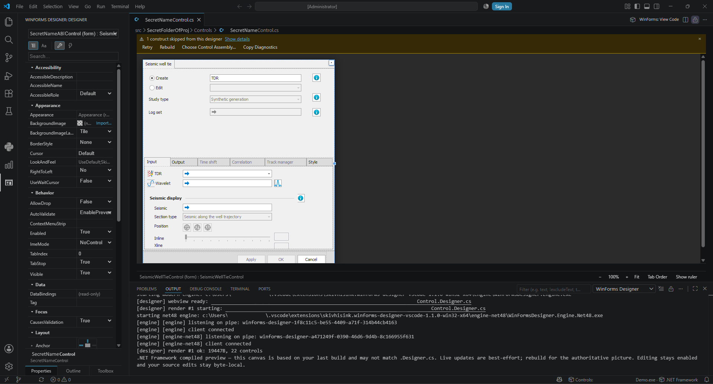

<div align="center">

# WinForms Designer for VS Code

**A Visual Studio–style WinForms form designer, running natively inside VS Code.**

Render, click-select, edit and lay out `.Designer.cs` forms — live — without leaving the editor.

[](https://github.com/SkivHisink/winforms-designer-vscode/actions/workflows/ci.yml)
[](LICENSE)
[](https://code.visualstudio.com/)
[](https://dotnet.microsoft.com/)
[](#-support-matrix)

</div>

<div align="center">



</div>

## 🎬 Drag & drop, live

Drop a control from the toolbox onto a **DevExpress** form and it lands where you put it — snaplines, selection handles and all — while the change goes back into `.Designer.cs` as a minimal edit.

<div align="center">



</div>

---

## What is this?

VS Code has no native WinForms designer — to draw a `Form` you normally have to open Visual Studio. **WinForms Designer for VS Code** brings that designer surface into VS Code:

- Open a form's `Form1.cs` (with its generated `Form1.Designer.cs` sibling) and a **live preview of the rendered form** appears — exactly as Visual Studio shows the designer.
- **Click any control** to select it; a **property grid** and **toolbox** dock alongside the canvas.
- **Edit properties, drag/resize controls, align, set tab order, wire events** — changes are written back into `.Designer.cs` as **minimal, byte-surgical text edits** (the rest of your file is preserved byte-for-byte).

The rendering is real: a headless .NET host actually instantiates your controls (including custom/3rd-party ones) and paints them with their real `OnPaint`, so the preview matches runtime. A DPI-aware backing capture stays **crisp on 4K / high-DPI** monitors while layout and hit-testing remain in logical WinForms pixels. Two engines are bundled — a **.NET 10 LTS** engine for modern `.NET 8` / `.NET 9` / `.NET 10` projects and a **.NET Framework 4.8** engine for classic `net4x` / DevExpress projects — and each form is routed to the right one automatically.

## 📸 Screenshots

**A DevExpress form, designed in VS Code.** The canvas is your live `.Designer.cs` replayed onto the real vendor
controls; the property grid on the left is the `XtraForm` itself, not a stand-in.



**Vendor smart tags** — the control's own designer verbs, read off the compiled type:



**Choose Toolbox Items** — framework, project and browsed assemblies, with sortable columns:



**Zoom, snaplines and your own controls** — a custom gauge painted by its real `OnPaint` at 214%:



**A real production form** — hundreds of controls, a third-party suite, and an honest disclosure when a construct
falls outside what the designer can replay:



## ✨ Features

- **Live form rendering** from `.Designer.cs` — full frame plus fast per-control dirty-region patches.
- **.NET Framework & DevExpress support** — `net4x` forms render on a bundled **.NET Framework 4.8** engine that interprets your **live source** (the Visual Studio model) onto the compiled controls (so DevExpress `XtraUserControl` & co. look pixel-accurate); the extension auto-routes each form to the right engine, and the property grid, drag/resize/align, add/remove, z-order, cut/paste, tab-page add/rename/delete/reorder, dropping the project's own vendor controls from the toolbox, and the collection editors apply live on the interpreted picture. A construct the interpreter can't yet reproduce falls back to a disclosed compiled render of the last build.
- **Visual Studio–style workflow** — opening `Form.cs` opens the designer; *View Code* switches back to text.
- **Property grid** — primitives, enums, safe complex types, and bounded metadata-driven `TypeConverter` expansion for framework/vendor value objects. VS-style **Color**, **Font**, **flags-enum**, **Anchor/Dock**, **Cursor**, and **image** editors remain source-first; the supported framework Color/Font `UITypeEditor` dialogs run in a cancellable isolated process. **Component-reference** properties become compatible-component dropdowns, non-default values are **bold**, and right-click **Reset** restores the default.
- **Data-bound forms** — edit canonical `DataBindings` entries (target property, `BindingSource`, data member, formatting, update mode, and format string) and choose a supported `DataSource` as `(none)`, another component, or `typeof(T)`. Bound `DataGridView` columns expose `DataPropertyName`, format, alignment, and literal null-display values in the column editor. Editing is source-first and exact on both engines; the *preview* does not evaluate bindings (neither does Visual Studio's), so a `DataBindings.Add(…)` statement is reported as a skipped construct in the render note — and on the .NET Framework engine it means the form previews from your last build until that changes.
- **Collection editors** — the `…` button opens a Visual Studio–style **Collection Editor** for string collections, string arrays, allowlisted scalar/enum/complex `IList` / `IList<T>` values, `ListView.Columns`, `DataGridView.Columns`, and recursive `TreeView.Nodes`. Unsupported item types and non-canonical source expressions stay read-only. A panel **"Type Here"** editor also **reorders / adds / removes / renames** `MenuStrip` / `ToolStrip` items.
- **On-canvas menu & toolbar editing** — edit `MenuStrip` / `ToolStrip` items **directly on the strip**, Visual Studio–style: click the trailing **"Type Here"** slot to **add** (with a type picker), **double-click / F2** to **rename**, click to **select** and **Delete** — down through **nested submenus**, an **off-tree `ContextMenuStrip`** (from its tray chip), and the **overflow** area. Selecting an item opens **its own property grid** (with an **Events** tab), kept separate from the control selection. On **both** engines.
- **Images & `.resx`** — images stored in a form's sibling `.resx` are rendered in the preview; **import** or **clear** `Image` / `BackgroundImage` / `Icon`, and add, remove, reorder, or rename the keys of **ImageList** images. ImageList changes reconcile attached `ImageIndex` / `ImageKey` assignments in one undoable `.Designer.cs` + `.resx` transaction.
- **Localized forms** — `Localizable = true` / `ApplyResources` forms are editable across the neutral and culture-specific `.resx` files. **WinForms: Select Localization Culture** switches the designer context; scalar values, Color/Font values, geometry, localized images/icons, `RightToLeft`, and `RightToLeftLayout` are written to that culture without changing `.Designer.cs`. Removing an override restores normal ResourceManager fallback.
- **Tabbed forms** — click a standard `TabControl` header to switch the designer view, double-click to rename a page, use Add Tab / Delete Tab, or move the active page one position left/right on either engine. Reordering swaps only canonical adjacent `Controls/TabPages.Add[Range]` page references and fails closed on ambiguous source. The selected page is per-form workspace state on modern and net48 live-source canvases: it survives close/reopen without adding a `SelectedIndex` edit to generated source. A disclosed net48 compiled fallback remains build-derived and mirrors supported moves live.
- **Layout panels** — edit `TableLayoutPanel` cells and column/row styles, `SplitContainer` splitter distance, and `FlowLayoutPanel` order, with anchor tethers drawn on the canvas.
- **Toolbox** — auto-populated from `System.Windows.Forms` (~39 controls in VS categories, with their native icons) plus controls discovered from project outputs, configured probe directories, browsed libraries, and registered .NET assemblies. **Choose Toolbox Items** scans `.NET` libraries without instantiating controls, remembers chosen items and custom tabs across reloads, and uses the exact source assembly when adding a control or project reference. COM and WPF toolbox pages are explicitly unsupported and inert.
- **Control sources** — pick which project (`.csproj`) or assembly (`.dll`) supplies your custom / 3rd-party controls; dropping a control from an unreferenced assembly offers to add the project reference.
- **Direct manipulation** — select, move, resize (8 handles), keyboard nudge (arrow keys), multi-select (Ctrl/Shift + rubber-band), group move/delete, reparent, z-order, copy/paste, **duplicate** (`Ctrl+D`), **lock controls**, align + distribute + make-same-size, tab-order editor, snaplines, on-canvas **smart-tags**, and a VS-style right-click menu. Modern final free-control bounds are corrected by the real WinForms graph before the source transaction is accepted. Cross-form paste validates every typed binding/extender dependency first and names any unavailable dependency without changing source.
- **Events** — describe, wire / unwire / rewire handlers, generate a handler stub, and navigate to the handler body in the `.cs` partner.
- **Component tray** & **document outline** (ARIA-accessible) for non-visual components and the control hierarchy. Editable outline nodes support safe drag/reparent and keyboard/context z-order changes; inherited or unresolved nodes remain visible and read-only. Tray components show framework icons, support inline field rename, retain compatible component-reference dropdowns, and expose common `ToolTip`, `ErrorProvider`, and `HelpProvider` extender properties on their target controls.
- **Session continuity** — zoom, Lock Controls, the active designer tab, toolbox category state, outline state, custom toolbox tabs, and chosen items survive closing and reopening a form without modifying project files.
- **Localized UI (7 languages)** — the designer surface, dialogs and messages follow the `winformsDesigner.language` setting: English, Русский, 简体中文, Français, Deutsch, Español, हिन्दी.
- **Safe save** — edits are applied as targeted text splices guarded by representability and statement-diff gates; everything outside the changed span is preserved exactly (encoding/BOM included).
- **Zero-config assembly resolution** — finds your build output via MSBuild design-time evaluation (with multi-target support), or set an explicit assembly path.
- **Actionable diagnostics** — a degraded render names the affected target, cause, and statement while preserving the last good canvas as view-only; Retry, Rebuild, Choose Control Assembly, Copy Diagnostics, and Export Diagnostics provide direct recovery paths.

## 🏗️ Architecture

```
  Form1.cs  ─────────────┐
  Form1.Designer.cs ─────┤
                         ▼
        ┌────────────────────────────────────────────────┐
        │  Engine host — routed per form:                │
        │  • .NET 10 LTS engine (C#)                     │
        │      Roslyn parse → safe interpret →           │  render • describe • edit
        │      WinForms host → DrawToBitmap              │
        │  • .NET Framework 4.8 engine (C#)              │
        │      interpret live source (VS model) onto     │  render • describe • edit
        │      compiled net4x / DevExpress controls      │
        └────────────────────────────────────────────────┘
                         ▲  JSON-RPC over a named pipe
                         │  (StreamJsonRpc, camelCase DTOs)
                         ▼
        ┌───────────────────────────────────┐
        │  VS Code extension (TypeScript)   │
        │  custom editor + dockable panel   │
        └───────────────────────────────────┘
                         ▲
                         │ postMessage
                         ▼
        ┌───────────────────────────────────┐
        │  Webview (canvas preview +        │
        │  property grid / toolbox / tree)  │
        └───────────────────────────────────┘
```

| Part | Folder | Tech |
|------|--------|------|
| Rendering / editing engine (.NET 10 LTS) | [`engine/`](engine/) | C# · .NET 10 (`net10.0-windows`) · WinForms · Roslyn · StreamJsonRpc |
| .NET Framework engine | [`engine-net48/`](engine-net48/) | C# · .NET Framework 4.8 (`net48`) · WinForms · live-source IR interpretation onto compiled controls + disclosed compiled fallback · StreamJsonRpc |
| VS Code extension | [`extension/`](extension/) | TypeScript · esbuild · VS Code Custom Editor API |
| Webview UI | [`extension/media/`](extension/media/) | Plain JS (canvas + DOM) |
| Sample forms / fixtures | [`engine/samples/`](engine/samples/), [`samples/`](samples/) | `.Designer.cs` forms |

## 📦 Requirements

- **Windows x64 or Windows ARM64** — WinForms is Windows-only. Linux, macOS, WSL and Linux remote workspaces are not supported.
- **[.NET 10 Desktop Runtime](https://dotnet.microsoft.com/download/dotnet/10.0)** matching the VSIX architecture (`win32-x64` uses x64; `win32-arm64` uses ARM64) to run the primary engine. Building from source requires the .NET 10 SDK pinned by `global.json`.
- **.NET Framework 4.8** — for rendering `net4x` / DevExpress projects on x64. On Windows ARM64 this is a reduced-feature x64 compatibility fallback, not a native ARM64 engine; vendor controls and targeting packs must work under Windows x64 emulation. Building the `engine-net48/` engine from source needs the .NET Framework 4.8 targeting pack.
- **VS Code** `^1.84`.
- A **trusted workspace** — see [Security](#-security--workspace-trust).

### Windows ARM64

Version 1.4.0 packaging produces separate VSIX artifacts for `win32-x64` and `win32-arm64`. The ARM64 VSIX bundles the modern .NET engine with `dotnet publish -r win-arm64`, so modern `.NET 8` / `.NET 9` / `.NET 10` WinForms projects run through a native ARM64 engine when VS Code itself is ARM64.

The .NET Framework 4.8 path is deliberately more limited: it remains an x64 compatibility fallback for `net4x` / DevExpress projects and must not be described as native ARM64. If Windows x64 emulation, the .NET Framework targeting pack, or a vendor control suite cannot support that project on Windows ARM64, the net48 designer path is unsupported on that machine. See [Windows ARM64 support](docs/arm64-support.md).

## 🚀 Installing

Install from the **VS Code Marketplace** — search for **“WinForms Designer”**, or open the [Marketplace listing](https://marketplace.visualstudio.com/items?itemName=SkivHisink.winforms-designer-vscode).

> Requires **Windows x64 or Windows ARM64** and the matching **.NET 10 Desktop Runtime** (see [Requirements](#-requirements)). The **.NET Framework 4.8 engine** (for `net4x` / DevExpress forms) is native on x64 and a reduced-feature x64 compatibility fallback on Windows ARM64; it renders your **live source** through an IR interpreter, with a disclosed compiled fallback for constructs it can't yet reproduce — see the [support matrix](#-support-matrix).

### Build & run from source

```bash
# 1. Build the .NET engine
dotnet build engine -c Release

# 2. Build the extension
cd extension
npm ci
npm run build
```

Then open the `extension/` folder in VS Code and press **F5**. A *Extension Development Host* opens on the `engine/samples` folder with all other extensions disabled. Open **`SampleForm.cs`** to see the designer.

See **[CONTRIBUTING.md](CONTRIBUTING.md)** for the full dev loop, tests, and architecture notes.

## 🧭 Usage

1. Open a form's **`Form1.cs`** (it must have a sibling generated **`Form1.Designer.cs`**). The designer opens automatically — like Visual Studio.
   - You can also right-click a `.cs` file → **Reopen Editor With… → WinForms Designer**.
2. **Click a control** on the canvas to select it. Use the **Properties** panel to edit values, or drag/resize directly.
3. Drop new controls from the **Toolbox**.
4. Press **F4** to focus the Properties panel; use **View Code** to switch back to the text editor.
5. **Save** (the toolbar Save button / `Ctrl+S`) writes minimal edits back into `.Designer.cs`.

### Settings

| Setting | Default | Description |
|---------|---------|-------------|
| `winformsDesigner.autoOpenDesigner` | `true` | Open the designer automatically when a form's `.cs` becomes active. |
| `winformsDesigner.assemblyPath` | `""` | Explicit path to the built control assembly. Leave empty for auto-discovery; set it for multi-target / custom `OutputPath` / not-yet-built projects. |
| `winformsDesigner.net48.probeDirectories` | `[]` | Extra directories the **net48** engine searches for control assemblies it can't otherwise find — e.g. a 3rd-party control SDK installed outside the project's output and not in the GAC. The project's own output is always searched, so most projects need nothing here. Applies after a **Reload Window**. |
| `winformsDesigner.net48.releaseOnFocusLoss` | `false` | Release the **net48** build output whenever VS Code loses focus, so a build started in an **external Visual Studio** is never blocked by the open designer. Off by default: releasing unloads the preview, so the next edit waits for the assembly graph to load again (seconds, on a DevExpress form). Builds started **inside** VS Code release the output on their own, and **Release .NET Framework Assembly (for Rebuild)** remains available on demand. |
| `winformsDesigner.language` | `"en"` | UI language of the designer, dialogs and messages: `en` English, `ru` Русский, `zh-cn` 简体中文, `fr` Français, `de` Deutsch, `es` Español, `hi` हिन्दी. Chosen **here** (window scope) — it does **not** follow the VS Code display language. |

### Language

The designer surface, property grid, toolbox, dialogs and status / notification messages are localized and follow the **`winformsDesigner.language`** setting — seven languages: **English** (default), **Русский**, **简体中文**, **Français**, **Deutsch**, **Español**, **हिन्दी**. The language is picked in the extension settings, **not** from the VS Code display language, and switches **live** in already-open designer views. The VS Code **command palette** titles and the **settings page** itself follow VS Code's own *Display Language* (a platform limitation), so those pieces of chrome may stay in a different language until you **Reload Window** (you'll be prompted). Enum and color *values* stay canonical English so they remain typeable and round-trip cleanly.

That setting controls the extension UI. To edit a form's own translations, run **WinForms: Select Localization Culture**. Choose **(Default)** for the neutral `.resx`, choose an existing culture, or create a valid culture such as `fr-FR` or `ar-SA`. The selected culture is kept per form; parent-culture and neutral fallback remain visible, while an edited value is stored only in the selected layer.

## 🔒 Security & Workspace Trust

Rendering a designer **loads and runs your project's control assemblies** — control constructors and `OnPaint` execute when the preview is built. For that reason:

- The extension is **disabled in untrusted workspaces** (Workspace Trust).
- The engine **interprets `.Designer.cs` through strict allowlists** (only known-safe constructors, static calls, and property reads) — it does not execute arbitrary code from the file.

Only open projects you trust. To report a vulnerability, see **[SECURITY.md](SECURITY.md)**.

## 🗺️ Support matrix

**1.0 guarantees safe persistence.** Supported edits are written as **byte-local, conflict-checked** source splices; anything the designer can't persist safely is **refused with a stated reason**, never guessed. The **modern engine** renders your current source buffer. The **.NET Framework engine** interprets your **live source** (the VS model: parse `InitializeComponent`, instantiate the base type, replay onto the compiled controls), and its property panel + live edits re-derive from that interpreted picture; a construct it can't yet reproduce falls back to a compiled render of your **last build** with a **disclosed, named reason** — never a silent mismatch — and your source edits stay byte-local either way. See [Fail-closed by design](#fail-closed-by-design).

| Capability | Modern projects (`net8.0-windows` / `net9.0-windows` / `net10.0-windows`) | .NET Framework 4.8 (`net4x` / DevExpress, x64 native; ARM64 x64-compat fallback) |
| --- | :---: | :---: |
| Live render | ✅ interpreted from your current source (Roslyn, allowlisted) | ✅ live-source IR interpretation; disclosed compiled **last-build** fallback for unsupported constructs |
| Select · property grid (Color / Font / flags / Anchor-Dock / Cursor / image editors) | ✅ | ✅ |
| Move · resize · nudge · align · z-order · copy / paste · duplicate · lock | ✅ | ✅ live-rebuilt |
| Collection & "Type Here" editors · on-canvas menu / toolbar editing | ✅ | ✅ |
| DataBindings · DataSource · bound DataGridView column styles · common extenders | ✅ edits; binding statements skipped in the preview | ✅ source-first edits; a bound form previews from the last build |
| `.resx` images · ImageList editor · `ImageIndex` / `ImageKey` | ✅ | ✅ (binary via net48) |
| `Localizable = true` · neutral/per-culture `.resx` · RTL mirroring · localized scalar/image edits | ✅ | ✅ interpreted resource overlay; compiled fallback remains disclosed |
| Tab header navigation · add/rename/delete · selected-page continuity | ✅ | ✅ live-source; compiled fallback remains build-derived |
| Component tray · document outline · events · Modifiers | ✅ | ✅ |
| Inherited-form ownership (derived fields editable; inherited/unresolved nodes read-only) | ✅ | ✅ |
| Safe byte-surgical save | ✅ | ✅ (via modern Roslyn splice) |
| **Overall** | **Stable** | **Live-source preview** (IR interpreter, VS model) + disclosed compiled fallback |

### Fail-closed by design

Rather than risk a bad regenerate, the designer refuses to whole-file-save (with a named reason) when a form is backed by **binary `.resx`** it can't reproduce, references an **unresolved base type**, or contains a **statement it can't represent** without loss. A **capability preflight** names the category — `safe` / `localizable` / `binaryResx` / `unresolvedType` / `lostStatements` / `unrepresentable` — so nothing regenerate-based ever guesses. Ordinary limited forms use targeted byte-surgical source splices. A **`Localizable = true`** form instead uses a resource-first path: supported value, geometry, RTL, Color/Font, image/icon, and reset edits change only the selected culture's `.resx`, with exact multi-file preflight, one undo/redo transaction, and conflict-safe compensation. Unknown comments/nodes and opaque binary resources are preserved. Structural operations that require rewriting localized generated source remain explicitly refused.

The **.NET Framework engine** renders your **live `.Designer.cs` source** through an IR interpreter — the Visual Studio model: parse `InitializeComponent` (never execute it), instantiate the form's base type, and replay the parsed statements onto the *compiled* control instances (so real net4x / DevExpress controls paint), and the property panel + live edits read and re-derive from that same interpreted picture. A construct the interpreter can't yet reproduce falls back to a compiled render of your *last build* with a **disclosed, named reason** (`unrepresentableStatements` / `unsafeBinaryResource` / `baseTypeChanged` / …) — never a silent mismatch, and the boundary is fail-closed (a hostile `.Designer.cs` can't run arbitrary code on open). It stays **fully editable**; safety comes from the byte-local splice.

### Not yet

Arbitrary vendor-specific property editors and modal `UITypeEditor` operations beyond the supported framework
Color/Font pair, structural editing that would rewrite a localizable form's generated source, and executing a vendor's
full design-time service stack. Those operations remain fail-closed and are tracked for the extensible 2.0 host.

**`net4x` build coordination.** The preview renders a *real compiled instance* of your form and therefore loads your assemblies in place (shadow-copying would break delay-signed vendor controls). Use **WinForms: Run Build Task** / **Run Test Task** — `Ctrl+Shift+B` is routed through the coordinated build command while the designer is active — to release the output before the task, invalidate the compiled fallback, and re-render afterward. Build/test tasks launched elsewhere also trigger best-effort lifecycle coordination; **Release .NET Framework Assembly (for Rebuild)** remains available as a manual recovery control. The modern .NET engine interprets your source and does not pin the project output.

See the **[release roadmap](ROADMAP.md)** for the shipped 1.0 baseline, the 1.1 daily-workflow and
project-integration milestone, the verified 1.2 data-bound form workflow, the editor/layout/ARM64 completion in
1.3–1.4, enterprise localization in 1.5.0, cross-engine tab/session parity and release hardening in 1.6.0,
safe source-first tab ordering in 1.7.0, and the extensible design-time host planned for 2.0.0.

The safety core has fast C# and TypeScript unit coverage; the webview UI is validated headless (603 checks
across 149 tests), startup/render latency is guarded by a repeatable performance baseline, and activation,
engine startup, capabilities, and lifecycle diagnostics are smoke-tested in the real VS Code Extension Host on
VS Code 1.84 and current Stable. Found a rough edge? Please [file an issue](https://github.com/SkivHisink/winforms-designer-vscode/issues).

## 🤝 Contributing

Contributions are very welcome! Start with **[CONTRIBUTING.md](CONTRIBUTING.md)** — it covers the repo layout, build/test commands, the F5 dev loop, and the **security gates that must not be weakened**. Please also read the **[Code of Conduct](CODE_OF_CONDUCT.md)**.

- 🐛 Found a bug? Use the **Bug report** issue template (the **WinForms: Export Designer Diagnostics** command produces a ready-to-paste report).
- 💡 Have an idea? Open a **Feature request**.

## 📄 License

[MIT](LICENSE) © 2026 SkivHisink

Third-party material shipped in the extension — the VS Code codicon font, `vscode-jsonrpc`, and the engine's .NET dependencies — is credited in **[THIRD-PARTY-NOTICES.md](THIRD-PARTY-NOTICES.md)**.
