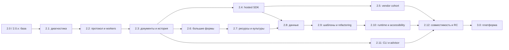

# Подробный roadmap: 2.0.0 → 3.0.0

**Дата планирования:** 22 сентября 2026 года.  
**Статус:** 2.1.0 реализован, локально проверен и упакован; 2.2.0–3.0.0 имеют статус `PLANNED`. Публикация 2.1.0 не выполнялась.  
**Продукт:** WinForms Designer for VS Code.  
**Горизонт:** от ограниченного, подтверждённого сценариями ядра 2.0.0 до расширяемой платформы 3.0.0 с опубликованными контрактами совместимости.

Документ определяет результаты релизов, порядок работ и критерии приёмки. Номера версий не являются календарным обещанием. Описанная возможность становится поддерживаемой только после реализации, проверки на заявленной матрице и обновления документации поддержки.

История 1.0.0–2.0.0 сохраняется в [основном roadmap](../ROADMAP.md). Детали предыдущей программы находятся в [плане 2.0.0](roadmap-v2.0.0-implementation-plan.md), а её результаты — в [отчёте от 26 августа 2026 года](release-2.0.0-gate-record.md). Этот новый документ продолжает программу и уточняет порядок оставшихся работ.

## Содержание

- [1. От какой базы начинаем](#baseline)
- [2. Что должен получить пользователь в 3.0.0](#vision)
- [3. Карта релизов и зависимостей](#release-map)
- [4. Подробные релизы](#milestones)
- [5. Архитектура и постоянные инженерные направления](#architecture)
- [6. Матрица поддержки и приёмки](#acceptance)
- [7. Отдельные исследования и границы программы](#research)
- [8. Ресурсы, порядок исполнения и пересмотр плана](#execution)
- [9. Первые 90 дней](#first-90-days)
- [10. Источники и технические точки входа](#sources)

<a id="baseline"></a>

## 1. От какой базы начинаем

### 1.1. Подтверждённое состояние репозитория

На момент подготовки плана `extension/package.json:6` задаёт версию `2.0.0`, а `extension/package.json:8` — `preview: false`. Modern engine нацелен на `net10.0-windows`, Framework engine — на `net48` с `PlatformTarget=x64`. Эти значения описывают исходники и упаковку, но сами по себе не подтверждают публикацию или полную совместимость с Visual Studio.

Текущий [каталог сценариев](v2/vs-parity-scenario-catalog.tsv) содержит 128 строк: 111 repository `PASS`, 12 `NOT_EXECUTED`, 5 `GATED`; отдельно записаны 40 reference `PASS` и 88 reference `NOT_EXECUTED`. Это пересчёт записанных статусов, а не новый прогон тестов. `HARNESS_ONLY` — отдельная характеристика автоматизации: 11 таких строк нельзя добавлять к числу продуктовых проверок.

Августовский gate record является историческим снимком. В частности, его сведения о dirty tree и HEAD на `v1.9.0` нельзя переносить на текущую ветку: перед изменением документации рабочее дерево было чистым, HEAD — `72a4ee3`, без тега непосредственно на HEAD. Публикация в Marketplace/Open VSX в рамках подготовки roadmap не проверялась.

| Область | Что уже есть | Что остаётся предметом 2.x |
|---|---|---|
| Основной цикл | Реальный render/select/edit/save, геометрия, дерево, toolbox, свойства, события, коллекции, меню и component tray | Более широкий корпус форм, единое поведение команд и измеримая скорость |
| Исходники | Минимальные правки, проверки ownership и ревизий, отказ при неоднозначной записи | Расширение поддерживаемых форм записи без потери пользовательского кода |
| Ресурсы | `.resx`, изображения, локализация, RTL, структурные операции в нейтральном языке для ограниченного набора случаев | Обзор культур, массовые операции, сложные зависимости ресурсов |
| Документы | Snapshot/PatchSet/journal, компенсация, Save As, ограниченное восстановление hot exit | Длинная история, несколько связанных артефактов, реальные обновления и откаты |
| Runtime | Рабочие modern/net48 процессы, повторное использование, восстановление после сбоя, координация сборок | Подключение общего supervisor к обычному трафику; политика нескольких проектов |
| Протокол v2 | Схема и проверяемые bindings, диагностический probe | Обычные render/describe/edit-запросы через версионированный контракт |
| Hosted services | Реальные, но узкие repository-certified сценарии smart tags, editors и adorners | Больше контрактов, реальный SDK, независимые адаптеры и vendor cohorts |
| Adapter manifests | Product discovery уже подключён в `activate`; выдаются metadata и diagnostics | Проверенный loader, активация, отзыв доверия, совместимость исполняемых адаптеров |
| Миграция | Реальная миграция toolbox state из global в workspace; отдельно экспериментальный контракт `v2Migration.ts` | Инвентаризация фактически сохраняемых форматов, проверка upgrade/rollback и миграция только необходимых изменений |
| Headless | Development CLI и стенды | Проверка настоящих проектов через те же product planners и engines |
| Качество | Unit, webview, named-pipe, Extension Host, reference traces и проверки VSIX | Расширение прямых доказательств, реальные ARM64/AT/vendor и длительные прогоны |

Три ограничения особенно влияют на последовательность работ:

1. `WorkerSupervisor` сейчас обслуживает диагностический probe; наличие класса ещё не означает управление всеми сессиями дизайнера.
2. `V2AdapterManifestRegistry` уже вызывается из activation, но специально не загружает assembly, не исполняет vendor code и не выдаёт право изменять проект.
3. Существующие recovery, редакторы, ресурсы и binding не нужно реализовывать повторно: новые релизы расширяют их границы и объединяют существующие пути.

### 1.2. Постоянные правила продукта

- Открытие формы не переписывает проект и не нормализует код.
- Каждая команда изменяет только заявленные артефакты; конфликт сохраняет внешние изменения пользователя.
- Поддержанная изменяющая команда имеет одну логическую границу Undo/Redo для всех затронутых артефактов. Привязка к native history, фокусу и открытому текстовому редактору проверяется для каждого объявленного сценария; единый произвольный стек разных типов редакторов не предполагается.
- Неподдерживаемый сценарий получает понятную причину и действие восстановления до изменения файлов.
- Исходники и ресурсы остаются источником истины; кэш и preview можно пересоздать.
- Состояние «проверено в тесте», «работает в продукте», «сравнено с Visual Studio» и «проверено на устройстве» учитывается раздельно.
- Загрузка проектных и vendor assemblies исполняет доверенный код. Изоляция процесса отвечает за управление жизненным циклом и восстановление; дополнительные ограничения требуют отдельного доказательства.
- Обновления 2.x сохраняют заявленные пользовательские сценарии. Возможные несовместимые изменения публичных контрактов заранее объявляются и готовятся к границе 3.0.0.

<a id="vision"></a>

## 2. Что должен получить пользователь в 3.0.0

**3.0.0 — повседневный WinForms designer внутри VS Code для явно перечисленных стандартных, пользовательских и сертифицированных сторонних контролов, с безопасным редактированием, расширениями и автоматизированной проверкой проектов.**

### Разработчик приложения

Открывает решение, выбирает форму, добавляет контролы, редактирует layout, события, данные и культуры, использует поддерживаемые smart tags и editors, сохраняет и собирает проект. При переходе между VS Code и Visual Studio в заявленном сценарии сохраняются семантика формы и посторонние участки файлов. Сбой designer worker не уничтожает несохранённую работу.

### Автор собственной библиотеки контролов

Подключает документированный SDK, объявляет точные возможности и зависимости, проверяет адаптер локальным conformance runner и получает адресные ошибки. Простому контролу без специального дизайнера SDK не требуется. Поведение дизайнеров modern .NET и net48 описано отдельными контрактами.

### Команда, поддерживающая большое приложение

Имеет воспроизводимую матрицу поддержки, отчёты о проблемах форм, проверку совместимости при обновлении библиотек и понятное восстановление. Диагностика не требует публикации исходного проекта. CI может проверить структуру и, на подходящем Windows runner, настоящую загрузку и render.

### Как измеряется достижение цели

- Ключевой поддерживаемый workflow завершается без обязательного ручного исправления generated code.
- Изменения проверяются по компонентному графу, семантике файлов, ожидаемому diff и Undo/Redo, а не по одному скриншоту.
- Сертификация всегда называет библиотеку, версию, runtime, архитектуру и список проверенных возможностей.
- Команда видит, какие ограничения обнаружены до обновления runtime или vendor suite.
- В 3.0.0 не включается функция только ради номера версии: обязательны контракт, product path, тесты, документация и сценарий восстановления.

<a id="release-map"></a>

## 3. Карта релизов и зависимостей

Все строки после исходной базы являются планом. Patch-ветка 2.0.x сопровождает основную работу и не задерживает исправления потери данных или критических регрессий.

| Версия | Основной результат | Ключевая зависимость | Условие перехода дальше |
|---|---|---|---|
| **2.0.0 / 2.0.x** | Зафиксированная база и актуальная карта ограничений | Текущее ядро | Исторические и текущие доказательства разделены, критические дефекты закрыты |
| **2.1.0** | Предсказуемая диагностика совместимости и восстановление рабочей среды | База 2.0 | Пользователь понимает отказ и может восстановить сессию |
| **2.2.0** | Общий протокол и supervisor на реальных командах | 2.1 + characterization | Все обязательные маршруты имеют прямой product E2E |
| **2.3.0** | Документы, связанные изменения и надёжный hot exit | 2.2 | Crash/restart/undo проверены для заявленных сложных транзакций |
| **2.4.0** | Hosted services и Adapter SDK Preview | 2.2–2.3 | Независимый sample использует опубликованный контракт |
| **2.5.0** | Первая настоящая vendor cohort и полезные редакторы | 2.4 + vendor access | Точная сертификация одного доступного набора версий |
| **2.6.0** | Быстрая работа с большими и вложенными формами | 2.2–2.3 | Зафиксированные performance budgets на реальном продукте |
| **2.7.0** | Ресурсы, культуры и визуальная проверка локализации | 2.3 + 2.6 | Связанные resource edits и RTL проверены без потери fallback |
| **2.8.0** | Завершённые прикладные сценарии data binding | 2.3–2.4 + 2.7 для локализованных форм | Сборка и runtime-проверка формы с изменённой моделью |
| **2.9.0** | Переиспользуемые формы, шаблоны и рефакторинги | 2.3 + 2.7–2.8 | Повторное применение и отмена не повреждают проект |
| **2.10.0** | Проверенная доступность и расширенная runtime-матрица | Накопленные UI/runtime функции + лаборатория | Реальные AT, DPI и аппаратные проверки заявленного набора |
| **2.11.0** | Product CLI, проверка проекта и design advisor | 2.2–2.3 + соответствующие capabilities | CLI вызывает настоящие product paths и выдаёт воспроизводимый отчёт |
| **2.12.0** | Заморозка контрактов, SDK RC и репетиция перехода | Все обязательные направления | Beta/RC evidence, migration и rollback готовы |
| **3.0.0** | Стабильная расширяемая платформа | 2.12 + независимая приёмка | Все обязательные возможности заявленной матрицы приняты |



Стрелки обозначают зависимости реализации, а не необходимость ждать выпуска всей предыдущей ветки. Исследования, accessibility-аудит, аппаратные проверки и подготовка vendor fixtures начинаются с 2.1; соответствующие номера обозначают момент консолидации результата. Независимые функции можно разрабатывать параллельно после стабилизации общих контрактов.

Vendor cohort является отдельным входом в финальную приёмку. Её недоступность не задерживает managed performance, accessibility и runtime-проверки; vendor-specific legs учитываются отдельно. Номера релизов обозначают целевую последовательность, которую можно пересмотреть с сохранением ID задач и истории переноса.

### 3.1. Обязательное ядро и управляемый объём

116 задач образуют полный предлагаемый backlog. Отметка `PLANNED` не равна обязательству реализовать все расширения до 3.0. Перед стартом minor-релиза фиксируются обязательные задачи, исследовательские решения и кандидаты; после неудачного теста нельзя менять эту классификацию только ради зелёного отчёта.

| Класс | Состав | Правило исполнения |
|---|---|---|
| Обязательное ядро | Сохранность существующих workflows, product protocol/lifecycle, документ и восстановление в доказанном scope, SDK 1.0, первая vendor cohort, заявленные CLI и support matrix | Основа R30-01–R30-08; сокращение требует явного пересмотра цели программы |
| Расширения-кандидаты | Более широкий Lane B (R24-08), virtualization при подтверждённой потребности (R26-03), pseudo-localization/visual comparison (R27-05/06), расширенные master-detail/settings bindings (R28-04/08), Extract UserControl и межпроектный перенос (R29-03/05) | Включаются после оценки пользы, технической пробы и доступной ёмкости; перенос не ослабляет проверки уже поддерживаемых функций |
| Исследования с решением | Общая custom/text история и восстановление redo-ветки (часть R23), modern designer ABI (часть R24), Tier D и OS sandbox | Результат исследования — доказанная модель или явное ограничение; невозможный вариант не становится скрытой обязательной зависимостью |

Приёмочные сценарии раздела 4 описывают полный целевой вариант каждого релиза. Если кандидат не включён, до начала приёмки публикуется более узкий сценарий с теми же требованиями к целостности. Базовые templates, существующие data binding и локализация остаются в обязательной регрессионной матрице независимо от судьбы дополнительных функций.

<a id="milestones"></a>

## 4. Подробные релизы

### 2.0.0 / 2.0.x — зафиксировать базу и сопровождать её

**Ценность:** пользователь получает устойчивую отправную точку; команда понимает, что можно расширять без повторного выполнения уже завершённых работ.

**Работы:**

- [ ] **R20-01. Карта продуктовых маршрутов.** Для каждого capability записать UI entry point, extension command, engine RPC, planner, transaction, reconciliation и прямой тест. Отдельно отметить helper-only, diagnostics-only и metadata-only пути.
- [ ] **R20-02. Актуальное приложение к baseline.** Сопоставить код, каталог, README и support matrix. Исправлять устаревшие текущие утверждения, сохраняя исторические gate records со своей датой и evidence identity.
- [ ] **R20-03. Регрессионный набор.** Выделить быстрые обязательные сценарии: open/no-op save, property, geometry, resource, event, undo, external conflict, failed render, worker crash, net48 rebuild.
- [ ] **R20-04. Сопровождение.** В patch-релизы включать исправления потери данных, зависаний, ложной совместимости и поломок существующих workflows. Новые возможности выпускать отдельными minor-релизами.
- [ ] **R20-05. Карточка артефакта.** При очередной реальной сборке сохранять source identity, версии инструментов, runtime, архитектуру, хеш VSIX и список выполненных проверок. Публикацию учитывать отдельно.

**Доказательство готовности:** известен воспроизводимый набор базовых сценариев, каждая заявленная возможность связана с продуктовым маршрутом, а package version не используется как доказательство качества или публикации.

**Не повторять:** создание существующих исходных редакторов, rollback, базового binding, локализации и tab workflow с нуля.

### 2.1.0 — диагностика, совместимость и управляемое восстановление

**Результат на 2 октября 2026:** `IMPLEMENTED / VERIFIED LOCALLY`.

Закрыты R21-01–R21-08. В тот же релиз вошли исправления движка для issues #6 и #7.

Всё доказательство переснято на финальном коде:
- 470 тестов расширения;
- 612 тестов модерн-движка и 50 тестов net48;
- два настоящих Extension Host прогона по 9/9;
- установка 2.0 → 2.1 → 2.0 с реальным SQLite state, восстановлением несохранённой формы и Undo/Redo;
- проверки обоих VSIX.

Базовый пакет 2.0 восстановлен из исходного состояния `72a4ee3`; это не утверждение о ранее опубликованном VSIX.

Сужения формулировок R21 записаны явно в разделе «Limits of this evidence». Команды, границы и машинные отчёты перечислены в [отчёте 2.1.0](release-2.1.0.md).

**Ценность:** пользователь быстро понимает, почему форма не открывается полностью, какая библиотека требуется и что именно сделает восстановление.

**Работы:**

- [x] **R21-01. Панель состояния формы.** Показать resolved project/TFM, engine/runtime/architecture, выбранную culture, источник preview, последнюю успешную сборку и ограниченные capabilities. Подробности раскрываются по необходимости.
- [x] **R21-02. Единый каталог причин.** Связать refusal code с конкретным объектом, свойством или assembly и действием: rebuild, выбрать assembly, перейти к коду, сбросить повреждённый cache или повторить render.
- [x] **R21-03. Диагностика bitness.** Учитывать evaluated project configuration, `PlatformTarget`, `Prefer32Bit`, PE architecture и native dependencies на обеих runtime-ветках. Различать «точно x86», «архитектура неизвестна» и «неподдерживаемый ActiveX».
- [x] **R21-04. Явный COM request contract.** Подключить именованный отказ для toolbox/API-запросов, чтобы неподдерживаемость не зависела только от скрытой вкладки webview. Сохранить существующий source-level ActiveX gate.
- [x] **R21-05. Диагностика adapter manifests.** Развить уже подключённый registry: объяснять несовместимый диапазон версий и runtime, дубликаты и невалидные capabilities. Принятый manifest не должен выглядеть как активированный исполняемый адаптер.
- [x] **R21-06. Восстановление среды.** Команды пересоздания кеша, повторного обнаружения контролов и перезапуска worker показывают ожидаемый результат; пользовательские файлы и несохранённые документы сохраняются.
- [x] **R21-07. Реальная миграция настроек.** Инвентаризировать существующие configuration, global/workspace mementos, toolbox cache, journal и backup: producer, consumer, версия, жизненный цикл. Сохранить работающую toolbox scope migration. Менять формат только при продуктовой необходимости; `v2Migration` переиспользовать после проверки пригодности, а не создавать новый cache ради подключения helper. Проверять фактически выпущенные состояния, повреждение, незавершённое обновление и возврат к выбранной поддерживаемой версии.
- [x] **R21-08. Воспроизводимый diagnostic bundle.** Версии, capability decisions, тайминги и correlation IDs экспортируются с ограничением размера и очисткой приватных путей/данных; исходники прикладываются только отдельным осознанным действием.

**Приёмка:** product Extension Host открывает исправную, частично поддержанную и ошибочную форму; показывает разные причины; выполняет соответствующее восстановление; сохраняет состояние документа. Старая установка действительно обновляется и откатывается, а не только проходит JSON helper test.

User settings, перестраиваемый cache и единственная копия несохранённых данных имеют разные правила. При downgrade старый build не должен уничтожать неизвестный backup/history format: до переключения нужен совместимый backup либо явно сохранённая копия данных с проверкой восстановления. Команда очистки cache не удаляет recovery данные.

**Зависимости:** база 2.0, `tierDCompatibility`, project resolver, registry, diagnostics и migration. Диагностика x86 не включает поддержку запуска x86 worker.

### 2.2.0 — рабочий протокол и управление процессами

**Ценность:** быстрые действия, смена формы, отмена и сбой библиотеки не приводят к запоздалому preview, зависшей сессии или чужому ответу в активном документе.

**Работы:**

- [x] **R22-01. Characterization перед выделением модулей.** Зафиксировать DTO, коды ошибок, геометрию, минимальный diff и Undo существующего трафика. Извлекать session/commands/render/lifecycle небольшими изменениями.
- [x] **R22-02. Version negotiation.** Реальные extension и engines согласуют protocol range, capabilities и binary build identity. Номер wire-протокола версионируется независимо от SemVer расширения.
- [x] **R22-03. Render/describe через envelope.** Перевести открытие, render, hit-test/selection metadata и property describe на session/document/request IDs, revision/generation, deadline и cancellation.
- [x] **R22-04. Mutations через тот же контракт.** Перевести property, geometry, structural, events и resource intents. До переключения задать стабильный operation ID отдельно от request attempt ID, fingerprint payload и commit-outcome record у единственного host commit owner на базе существующего journal. Повтор операции возвращает установленный результат без второго diff/Undo; тот же ID с другим payload отвергается. Неизвестный исход после crash сначала разрешается по journal и фактическим baselines. Этот минимальный механизм входит в 2.2, а не откладывается до общей истории 2.3.
- [x] **R22-05. Подключить supervisor к продукту.** Перенести владение обычными workers из диагностического proof в реальный lifecycle, сохранив уже работающие lazy start, warm reuse, idle exit и rebuild release.
- [x] **R22-06. Worker identity.** Зафиксировать эффективный owner project/configuration/TFM/platform и fingerprint зависимостей на базе существующего resolver. Определить ключи runtime × architecture × dependency graph × trust policy. Сессии несовместимых проектов не переиспользуют случайно один graph; число резидентных процессов ограничено настройкой и бюджетом.
- [x] **R22-07. Quotas и backpressure.** Ограничить очередь, размер payload, время исполнения, память и handle growth. Metadata/render requests можно объединять; изменяющие команды нельзя терять при throttling.
- [x] **R22-08. Partial update и recovery.** Проверить несовпавшие extension/engine версии, отсутствующий payload, late reply после recycle, повторный crash и отмену во время закрытия документа. Повреждённая установка даёт действие восстановления.

**Порядок внедрения:** read-only requests → источник patch proposals → остальные mutations → lifecycle ownership. В переходный период допустим адаптер к прежнему transport; одна команда всегда имеет одного владельца и один write path.

Граница повторения фиксируется до миграции: срок хранения operation records, restart, закрытие документа, новый revision и очистка journal. Vendor callback с неизвестным исходом автоматически не повторяется: отсутствие второго workspace diff не исключает внешних эффектов кода. Legacy peer без нужного контракта использует проверку состояния и явный отказ от автоматического retry. При переключении на прежний маршрут сначала завершаются или восстанавливаются in-flight команды; их IDs и journal не отбрасываются.

**Приёмка:** drag/property/resource/save/rebuild/crash выполняются через настоящий supervisor на modern и net48. Диагностический probe не заменяет эти проверки. Тесты искусственно переставляют ответы, отменяют запросы, убивают worker и открывают два несовместимых проекта.

**Откат:** прекратить приём новых операций, завершить либо восстановить/компенсировать pending transactions, сохранить dirty buffers и backups, инвалидировать прежние generations и снять worker ownership; после этого включать прежний маршрут. При неопределённом исходе переключение ждёт reconciliation и не создаёт второго commit owner. Перезапуск Extension Host допустим как документированное условие. Проверить откат во время pending edit и после записи journal, а не только на idle форме. До включения по умолчанию новая ветка не уступает baseline по корректности и установленным задержкам.

### 2.3.0 — единый документ, история и восстановление

**Ценность:** несколько дизайнерских действий и связанных файлов переживают закрытие окна, перезапуск VS Code и внешнюю правку без потери работы.

**Работы:**

- [ ] **R23-01. Полное владение документом.** Разделить on-disk bytes, unsaved editor buffers, durable journal и transient preview. Отдельно определить несколько CustomEditor views одного документа и сосуществование со стандартным TextDocument: общий источник данных не означает общий native Undo stack. До расширения выполнить техническую пробу на публичном API и минимальном/current VS Code.
- [ ] **R23-02. Все writers в общую транзакцию.** Свести property, geometry, events, source/resource/project edits к одному orchestration contract на базе существующих PatchSet и journal.
- [ ] **R23-03. Несколько Undo после hot exit.** После технической пробы расширить доказанный единичный сценарий до ограниченной истории, например 20 операций. Сериализовать проверяемые изменения и checkpoints, а не callbacks. Раздельно проверить undo применённых операций, новое redo после undo и восстановление redo-ветки, уже существовавшей до выхода. Последний сценарий включается только при доказанной поддержке публичным API; иначе публикуется ограничение с сохранением последнего состояния документа.
- [ ] **R23-04. Многофайловое восстановление.** Отработать создание event handler, localized control add/delete, image import и Save As со связанными артефактами. Journal должен различать применённое, компенсированное и требующее ручного решения.
- [ ] **R23-05. External change UX.** При внешнем изменении показать затронутые файлы и безопасные варианты: reload, сохранить текущую работу под другим именем, открыть diff. Автоматическая компенсация не перезаписывает чужие байты.
- [ ] **R23-06. Save As и перемещение путей.** Проверить collision, изменение файловых путей, casing Windows, open buffers, связанные cultures и project membership для поддержанного Save As. Сохранение или преобразование generated names/namespace описать явно; общий semantic rename подключается к этому recovery contract в 2.9.
- [ ] **R23-07. Recovery timeline.** Показывать последние операции, сбой и доступную точку восстановления без автоматического раскрытия исходников в diagnostic logs.
- [ ] **R23-08. Crash injection.** Покрыть остановку после prepare, каждого write, регистрации Undo и commit; отдельно — read-only файл, нехватку места, отмену и изменение файла другим процессом.

**Приёмка:** реальные два запуска VS Code восстанавливают несколько действий и несколько артефактов на обеих engines; save и отмена дают ожидаемые хеши. Ограничение длины истории и поведение при превышении лимита документированы.

**Ранняя техническая проба:** dirty и clean checkpoint, Save/Save All/auto-save посреди истории, закрытие с непустой redo-веткой, смена фокуса между designer/code, внешние и чередующиеся ручные правки, частичный отказ Undo, два разных документа и два CustomEditor views одного документа. При отрицательном результате базовое обязательство — восстановление данных и доказанного набора логических транзакций; общая native history и дополнительные views остаются явно ограниченными. Частный workbench API не используется как обход. Объём истории и обновлённый сценарий приёмки фиксируются до разработки широкого recovery UI.

**Техническая граница:** backup восстанавливает данные; произвольные process objects, делегаты и сериализованные vendor graphs не становятся форматом документа. Поведение сверяется с [Custom Editor API VS Code](https://code.visualstudio.com/api/extension-guides/custom-editors), включая собственную ответственность расширения за backup и редактируемые custom documents.

### 2.4.0 — hosted services и Adapter SDK Preview

**Ценность:** разработчик библиотеки может добавить специальные дизайнерские команды и редакторы через воспроизводимый публичный контракт.

**Работы:**

- [ ] **R24-01. Реестр service contracts.** Для container/siting, selection, component change, naming, command, toolbox, type resolution и serialization задать методы, STA/lifetime, cancellation, reentrancy и поведение отказа.
- [ ] **R24-02. Расширить существующий kernel.** Добавлять service по одному на modern/net48 с реальным вызовом из UI. Ненулевой `IDesignerHost` не считается достаточным доказательством полноты.
- [ ] **R24-03. SDK 0.x.** Предоставить schema, typed intents/results, capability declaration, package layout, sample adapter, host compatibility matrix и инструкцию диагностики. Preview несовместимости обозначаются версией SDK и migration notes.
- [ ] **R24-04. Loader поверх registry.** Проверять реальные файлы, hashes, подпись/происхождение по выбранной политике, product cohort и trust settings до загрузки. Строка `signed-vendor` в JSON не выдаёт права на исполнение.
- [ ] **R24-05. Trusted development mode.** Автор своего адаптера может явно включить локальную разработку без утверждения vendor certification. Режим изолирован от сертифицированной product-матрицы.
- [ ] **R24-06. Editors broker.** Расширить supported modal/dropdown editors: ownership native окна, фокус, Escape/Cancel, timeout, nested invocation, тип и invariant representation результата.
- [ ] **R24-07. Adorners и smart tags.** Описать стабильные hit targets, клавиатурную альтернативу, disabled reasons и маршрут команды в source transaction. Render-only embellishment не получает write authority.
- [ ] **R24-08. Lane B по доказанным типам операций.** Расширять owned-region serialization только для случаев с независимыми postconditions; неизвестные statements, ресурсы, encoding и пользовательские partials сохраняются.
- [ ] **R24-09. Conformance runner.** Независимый sample собирается вне исходников расширения и проходит success/refusal/cancel/undo/restart без private test hooks.

**Приёмка:** два sample adapters показывают разные контракты — designer action и property editor. Неполный service, изменённый assembly, неправильный тип результата и revoked enablement блокируются до mutation. Публикуется точный список возможностей SDK Preview.

**До фиксации SDK Preview:** проверить один настоящий modern designer/editor на `Microsoft.WinForms.Designer.SDK` и отдельный classic sample на `System.Design`. Записать assembly/API identities, требуемые services и границу native UI. Проба отвечает, возможна ли прямая интеграция или нужен явный адаптер; собственный sample SDK не доказывает совместимость существующих vendor binaries. Если требуются недокументированные VS/DesignToolsServer protocols или неподтверждённые redistributable binaries, такой вариант отклоняется по ADR 0003. Решение принимается до обещания первой vendor cohort.

**Зависимости:** product supervisor, единая command authority, migration и transaction recovery. Modern designers и net48 designers проверяются отдельно: официальная модель [WinForms design-time API](https://learn.microsoft.com/en-us/dotnet/desktop/winforms/controls-design/designer-differences-framework) различает их namespace и взаимодействие editor UI.

### 2.5.0 — первая vendor cohort и расширенные редакторы

**Ценность:** разработчик реального приложения знает, какие возможности конкретной версии библиотеки работают, и использует её основные дизайнерские инструменты.

**Работы:**

- [ ] **R25-01. Выбрать cohort по доступности.** Первая кандидатура — DevExpress, поскольку в репозитории есть sample и опыт интеграции. Выбор точной версии зависит от доступных лицензированных артефактов; он не считается сделанным заранее.
- [ ] **R25-02. Сертификационный паспорт.** Зафиксировать product/version, assembly hashes, .NET/architecture, required services, editor types, известные исключения и версию reference environment.
- [ ] **R25-03. Основной пользовательский путь.** Открыть форму с vendor controls; выбрать, изменить стандартные и специальные свойства; выполнить action list; отредактировать поддержанную коллекцию; save/undo/reopen/build.
- [ ] **R25-04. Прикладные редакторы.** Выбрать востребованные коллекции: grid columns, tab pages, menu items или layout items. Для каждого описать идентичность элементов, имена, ссылки, ordering и сохранение неизвестных свойств.
- [ ] **R25-05. Сосуществование версий.** Два проекта с разными версиями одной suite работают без подмены assembly graph. Обновление библиотеки инвалидирует только относящиеся к ней cache/certification decisions.
- [ ] **R25-06. Vendor failure corpus.** Проверить зависание, исключение converter/editor, невалидный result, licensing failure и native dependency mismatch. Ошибка одного editor не отменяет здоровые документы.
- [ ] **R25-07. Cross-tool round trip.** Архивировать VS Code → Visual Studio → VS Code с ожидаемыми semantic/source/resource changes и нормальным runtime build.
- [ ] **R25-08. Управление адаптером.** Включение, отключение, обновление и возврат предыдущей версии сохраняют документ и дают понятный статус совместимости.

**Приёмка:** хотя бы одна точная cohort имеет полноценный паспорт и проходит порог Tier C. Все обязательные сценарии и проверки целостности проходят полностью. Прочие vendor versions остаются generic/best effort или unsupported по фактическим capabilities.

**Если артефакты недоступны:** выпускать общие улучшения editors под точным названием, а пункт сертификации оставлять `GATED`. `FakeVendor` сохраняет роль тестового fixture и никогда не подменяет независимую vendor cohort.

### 2.6.0 — большие формы, точная компоновка и отзывчивость

**Ценность:** форма с сотнями контролов остаётся удобной для поиска, выбора, редактирования и перемещения между вложенными контейнерами.

**Работы:**

- [ ] **R26-01. Реальный performance corpus.** Зафиксировать обязательные standard/custom-managed формы на 50/300/1000 контролов: вложенные, data-bound и localizable. Vendor corpus измерять отдельной проверкой при наличии артефактов; его отсутствие не блокирует managed performance milestone и не закрывает vendor acceptance. Указывать число layout nodes и глубину дерева, а не только число полей.
- [ ] **R26-02. Расширить incremental updates.** Существующий retained Text/leaf render использовать как исходную точку. Добавлять доказанные invalidation kinds для property, geometry и container updates; неоднозначный случай вызывает корректный полный render.
- [ ] **R26-03. Property grid и outline.** Ввести virtualization там, где profiling показывает пользу, сохранив стабильную selection identity, поиск, раскрытие, клавиатурную навигацию и accessibility tree.
- [ ] **R26-04. Работа с layout constraints.** Отображать причины недоступной геометрии: Dock, Anchor, AutoSize, TableLayoutPanel, FlowLayoutPanel, SplitContainer и inherited ownership. Предлагать подходящую команду контейнера.
- [ ] **R26-05. Массовая геометрия.** Расширить существующее выравнивание и multi-selection: равные интервалы, распределение внутри контейнера, resize группы и осмысленный preview при ограничениях. Все цели проверяются до общей mutation.
- [ ] **R26-06. Навигация по сложной форме.** Поиск по name/type/text, переход от свойства к control, breadcrumb контейнера, поиск скрытого или перекрытого элемента и временная визуальная подсветка без изменения Visible/source.
- [ ] **R26-07. Динамические metadata.** Инвалидировать descriptor/cache по изменениям зависимых свойств; зависший converter не блокирует всю панель. Кеширование не выдаёт устаревший editor или dropdown.
- [ ] **R26-08. Несколько открытых форм.** Приоритет активной сессии, остановка ненужного render и ограничение резидентных surfaces. Смена активного документа не теряет selection, zoom и несохранённое состояние.
- [ ] **R26-09. Измерения полного действия.** Разделить input→feedback, command→commit, commit→authoritative render, cold open и warm open. Отчёт включает samples, p50/p95, outliers и причины полного render.

**Начальные целевые бюджеты для калибровки:**

| Операция | Цель на зафиксированной машине и corpus | Как принимать |
|---|---|---|
| Локальная обратная связь canvas | p95 ≤16,7 мс для кадра при 60 Гц | Pointer/keyboard feedback; без требования полного WinForms repaint каждый кадр |
| Warm scalar commit, простая форма | p95 ≤100 мс | От отправки intent до подтверждения transaction |
| Warm scalar commit, 300 контролов | p95 ≤250 мс | Commit и render измеряются отдельно |
| Полное scalar edit → authoritative canvas | Порог по каждому corpus/runtime утверждается на пилоте до freeze | Один operation ID от UI input до правильных pixels/layout/properties; быстрый commit без обновлённого preview не считается завершённым действием |
| Warm open, 300 контролов | p95 ≤3 с modern / ≤5 с net48 | Готовность корректного canvas и properties |
| 1000 контролов | Первоначально characterization; порог утверждается после измерений | Нет зависания, потери команд и неограниченного роста памяти |
| 500 open/edit/close циклов | Нулевое число оставшихся owned processes после завершения | Память/GDI/USER оцениваются после warm-up с учётом noise envelope |

Это **плановые цели**, а не результаты текущего запуска. Ранее записанное 300-control evidence и существующий `perf:baseline` не заменяют эту лабораторную матрицу. После пилота допускается изменить цель до начала приёмки с явным обоснованием и сохранением прежних измерений.

**Протокол измерений:** перед приёмкой зафиксировать OS/CPU/RAM/DPI, версии binary/toolchain, корпус, warm-up и тайм-ауты. Для p95 действий и открытия — не менее 100 измерений на каждую заявленную комбинацию corpus/runtime/architecture, распределённых минимум по трём независимым сессиям; cold и warm не смешиваются. Сохранять raw samples, failures, timeouts и причины исключений; медленные результаты не отбрасывать для улучшения percentile. Ошибки оцениваются отдельно и не могут превратиться в быстрый успешный результат. Короткий CI smoke не подменяет этот benchmark. Для leak trend фиксируются warm-up, частота замеров и допустимый noise envelope до прогона.

**Приёмка:** воспроизводимые отчёты до/после, отсутствие semantic/source regression и устойчивый ввод при 1000 controls. Оптимизация не отключает postconditions, cancellation или source preservation.

### 2.7.0 — ресурсы, культуры и проверка локализованных форм

**Ценность:** переводчик и разработчик видят состояние ресурсов целиком, находят потерянные переводы и проверяют длинный текст/RTL до запуска приложения.

**Работы:**

- [ ] **R27-01. Обзор культур.** Таблица neutral/parent/exact значений, наличие override, источник fallback и статус перевода. Поиск по control/property/resource key.
- [ ] **R27-02. Массовые resource operations.** Создание культуры, копирование выбранных значений, удаление override и reset группы свойств проходят одной транзакцией с просмотром затронутых файлов.
- [ ] **R27-03. Resource dependency graph.** Показывать, какие формы и свойства используют image/icon/string. Rename ключа обновляет только доказанные ссылки; неизвестные expressions блокируют опасную операцию.
- [ ] **R27-04. Asset workflow.** Пакетный импорт изображений, обнаружение дубликатов по содержимому, замена с сохранением ссылок, проверка размеров и прозрачности. Существующий ImageList editor расширяется без изменения его идентичностей.
- [ ] **R27-05. Pseudo-localization.** Временное удлинение текста и выделение непереведённых строк для preview. Сохранение такого результата — отдельная явная команда, а обычное переключение режима не создаёт resource diff.
- [ ] **R27-06. Visual comparison.** Сравнение культуры с neutral, размеров текста и положения элементов при нескольких DPR. Предупреждения о возможном clipping являются советом, а не гарантией дефекта.
- [ ] **R27-07. Структурные операции.** Расширить add/delete/reparent в localizable forms с учётом всех culture resources. По умолчанию структура меняется в neutral layer; исключения требуют отдельного контракта.
- [ ] **R27-08. Inheritance и shared resources.** Отделить ресурс базового класса от override производной формы; не переносить ownership между ними автоматически.
- [ ] **R27-09. RTL acceptance.** Проверить native RightToLeft/RightToLeftLayout, mirrored geometry, tab order, keyboard, menus и resource fallback на modern и net48.

**Приёмка:** форма с neutral, parent и exact culture переживает импорт, переименование, structural edit, undo, restart и cross-tool round trip. Неизвестные XML nodes, comments и opaque resources сохраняются. Pseudo-localization без сохранения оставляет файлы точными.

**Зависимости:** многофайловые транзакции и корректная геометрия. Внешние сервисы перевода не являются обязательной зависимостью релиза.

### 2.8.0 — прикладные сценарии data binding

**Ценность:** пользователь создаёт и сопровождает форму ввода или таблицу данных, видит связи и умеет обновить их после изменения модели.

**Работы:**

- [ ] **R28-01. Единый обзор bindings.** Связать существующие Data Sources, BindingSource, DataBindings, DataMember, formatting и update mode в одном представлении зависимостей.
- [ ] **R28-02. Генерация формы из выбранных полей.** Расширить существующие scaffold-команды: details, grid, labels, navigation и validation components по явному выбору пользователя. Preview перечисляет имена и файлы.
- [ ] **R28-03. Schema refresh.** После изменения POCO/typed DataSet определить переименованные, удалённые и несовместимые поля. Предложить проверяемые изменения и сохранить пользовательские настройки колонок.
- [ ] **R28-04. Master-detail.** Поддержать ограниченные, явно объявленные связи BindingSource/DataMember; корректно создавать и удалять зависимые components, labels и subscriptions.
- [ ] **R28-05. Форматирование и validation.** Редактировать culture-sensitive formats, null display, value conversion и поддержанные ErrorProvider-связи, сохраняя существующие literal/typed ограничения.
- [ ] **R28-06. Design-time sample data.** Строить временный детерминированный sample из локально описанной схемы. Preview не требует подключения к production database или сохранения test data в приложение.
- [ ] **R28-07. Typed DataSet.** Расширить уже существующую генерацию до обновления модели с проверкой generated files, build и ownership. Provider-specific конструкции остаются отдельными capabilities.
- [ ] **R28-08. Application settings bindings.** Исследовать и реализовать bounded subset привязок к settings с корректным reset/default, доступностью типа и сохранением проектных артефактов.
- [ ] **R28-09. Runtime smoke.** Для каждого генерируемого сценария собрать sample и проверить начальное отображение, изменение значения и поведение formatting/update mode.

**Приёмка:** developer создаёт detail/grid workflow, меняет схему, обновляет binding, отменяет обновление и снова собирает приложение. Unsupported member или expression даёт отказ до структурной записи.

**Граница:** дизайнер не становится ORM, редактором SQL, хранилищем credentials или системой миграции базы данных. Такой код остаётся ответственностью приложения и профильных инструментов.

### 2.9.0 — шаблоны, переиспользование и безопасные рефакторинги

**Ценность:** типовые экраны создаются быстрее, а перенос группы контролов или переименование формы не превращается в ручное редактирование множества файлов.

**Работы:**

- [ ] **R29-01. Шаблоны поверх scaffolding.** Расширить существующее создание Form/UserControl: локальный каталог форм, наборы controls, стартовые layout/data patterns, preview и правила параметров.
- [ ] **R29-02. Reusable snippets.** Сохранять группу контролов с зависимостями: resources, BindingSource, ImageList, extenders, события. При вставке пересчитывать имена и проверять доступность типов.
- [ ] **R29-03. Extract UserControl.** Реализовать ограниченную команду для доказанного поддерева. План включает source/resources/project membership, перенос координат и отказ при неопределимых внешних references.
- [ ] **R29-04. Rename form/control.** Интегрироваться с доступным C# semantic rename и независимой проверкой references. При недоступном language service показывать точное ограничение, а не применять regex ко всему проекту.
- [ ] **R29-05. Перенос между проектами.** Развить dependency-aware clipboard: target runtime, culture resources, assemblies, имена и generated files проверяются до mutation. Добавление package dependency требует отдельного рассмотрения конкретного изменения.
- [ ] **R29-06. Project context UX.** Расширить интерфейс выбора configuration/TFM/platform для linked и multi-target файлов и переноса между проектами. Использовать эффективный контекст и invalidation contract, зафиксированные в 2.1–2.2; сохранять осознанный выбор пользователя.
- [ ] **R29-07. Inheritance workflow.** Создание производной формы, навигация к базовому control, отображение protected/private ownership и обновление после изменения base project.
- [ ] **R29-08. Обзор изменений.** Крупная генерация/рефакторинг показывает структуру результата, файлы, dependencies и diff. Подтверждение относится к конкретному плану; изменение revision требует перепланирования.

**Приёмка:** один sample проходит создание из template → редактирование → выделение UserControl → rename → перенос в другой совместимый проект → undo/reopen/build. Повторное применение не создаёт случайные дубликаты или повреждённые links.

**Граница:** доступные semantic services и поддержанный subset определяют возможности команды. Полная автоматическая переделка произвольной формы не заявляется.

### 2.10.0 — доступность и подтверждённая runtime-матрица

**Ценность:** поддержка разных устройств, DPI, клавиатуры и screen readers подтверждается реальными пользовательскими задачами.

**Работы:**

- [ ] **R210-01. Accessibility audit с начала программы.** С 2.1 вести список препятствий; здесь консолидировать исправления всех новых UI: property grid, dialogs, toolbox, outline, tray, smart tags, diff и recovery.
- [ ] **R210-02. Полный keyboard workflow.** Открыть форму, найти control, изменить property, вызвать editor, выполнить layout, переключить culture, сохранить и отменить без мыши. Не допускать focus traps.
- [ ] **R210-03. Assistive technology.** Реальные Narrator и NVDA на Windows: labels, roles, order, selection, expanded state, mixed values, validation и announcements. Один экранный диктор не подменяет проверку второго.
- [ ] **R210-04. Масштаб и контраст.** Проверить 200%/400% UI zoom, Windows text scaling, forced colors/high contrast, focus indicators и отсутствие зависимости только от цвета.
- [ ] **R210-05. Физический DPI.** Несколько мониторов и DPR 1/1,25/1,5/1,75/2; перенос окна, масштабирование, native editor positioning и hit testing. Логические координаты сравниваются отдельно от pixels.
- [ ] **R210-06. ARM64 qualification.** Проверить нативный modern worker и отдельно net48 x64 compatibility, включая packaging, install, custom/vendor dependencies, rebuild и recovery на физической машине.
- [ ] **R210-07. Runtime lifecycle policy.** Пересматривать поддерживаемые TFM и минимальный VS Code до каждого release candidate. Разделять runtime приложения, runtime bundled host и архитектуру процесса.
- [ ] **R210-08. Clean-machine checks.** Установка обоих VSIX на подходящих чистых Windows environments, отсутствие случайной зависимости от development checkout и установленных у разработчика assemblies.
- [ ] **R210-09. Диагностика неподдержанного окружения.** Указывать конкретную причину: OS/runtime/architecture/native dependency/AT limitation, сохраняя возможность открыть исходный код.

**Приёмка:** записи лабораторных сценариев с версиями OS, оборудования, VS Code, runtime и AT. Различать automated DOM result, native UI observation и hardware evidence.

**Зависимости:** лаборатория и доступные устройства нужны заранее. Базовая accessibility является условием каждого предыдущего UI-релиза; её нельзя откладывать до 2.10.

### 2.11.0 — product CLI, проверка решения и design advisor

**Ценность:** команда находит проблемы форм при review и в CI, а разработчик получает адресные подсказки с понятным diff исправления.

**Работы:**

- [ ] **R211-01. Product headless runner.** Переработать development CLI так, чтобы он обнаруживал реальные проекты/формы, разрешал их контекст и вызывал product planners/engines. Входной JSON с заявленным успешным результатом не является проверкой проекта.
- [ ] **R211-02. Два режима.** Parse-only использует отдельное статическое чтение source/project metadata без MSBuild evaluation, restore, SDK resolvers, source generators, assembly loading и design-time code. Неопределимые imports/conditions остаются `UNKNOWN/NOT_EXECUTED`; переход к исполняющему resolver не происходит автоматически. Trusted render/round-trip на подходящем Windows runner включается явно. Отчёт говорит, какой режим был выполнен и что осталось непроверенным.
- [ ] **R211-03. Стабильный report contract.** JSON schema, exit codes, diagnostics с location/capability/runtime, format version, bounded logs и машинно-читаемые `PASS/FAIL/GATED/NOT_EXECUTED`.
- [ ] **R211-04. Отдельная поставка CLI.** Определить пакет, runtime dependencies, обновления и лицензионный состав. Менять текущий запрет включения development bundles в VSIX только вместе с новым release contract и проверкой упаковки.
- [ ] **R211-05. Проверка обновления зависимости.** Сравнить capability map до/после выбранного изменения library/runtime на копии fixtures или в read-only режиме; показать новые несовместимости и изменение render/семантики.
- [ ] **R211-06. Advisor в Problems.** Правила для отсутствующих AccessibleName, подозрительного tab order, локализуемого literal Text, возможного clipping и неразрешённых ресурсов. Разделять доказанный дефект и рекомендацию.
- [ ] **R211-07. Preview и apply fix.** Расширить существующий product High-DPI preview/apply на новые правила. Исправления проходят обычный intent→PatchSet→revision check→Undo. Оставшиеся harness-only inspector/advisor сценарии заменяются прямыми тестами ingress, UI и реальной mutation/refusal.
- [ ] **R211-08. Baseline и suppressions.** Команда хранит согласованные исключения без маскировки новых ошибок; устаревшие suppressions определяются по stable diagnostic identity.
- [ ] **R211-09. Диагностика для поддержки.** Автоматический минимальный reproducible report без vendor binaries и пользовательских исходников по умолчанию; sensitive-value canaries проверяют настоящий export path.

**Приёмка:** чистый Windows runner анализирует и рендерит sample solution, находит намеренно внесённый дефект, завершается правильным exit code и не меняет project files. Принятый пользователем advisor fix исправляет дефект и отменяется одной Undo.

Parse-only отдельно проходит fixture с исполняемым project/toolchain hook: доказано отсутствие его запуска, а требующий evaluation результат остаётся неизвестным. Производительный общий resolver допустим только в trusted режиме.

**Граница:** parse-only результат не означает, что control реально загрузился или отрисовался. Generic automation API не принимает произвольный source patch от клиента в обход planner.

### 2.12.0 — заморозка контрактов и подготовка перехода

**Ценность:** пользователи и авторы адаптеров могут заранее проверить обновление до 3.0, узнать о несовместимостях и подготовить откат.

**Работы:**

- [ ] **R212-01. Freeze support matrix.** Зафиксировать обязательные runtime/architecture/VS Code/vendor cohorts, сценарии и внешние acceptance legs. Каждое исключение имеет понятную причину и владельца.
- [ ] **R212-02. SDK RC.** Выпустить кандидат стабильного API с примерами, capability catalogue, error taxonomy, test harness и правилами обновления schema. Независимый adapter maintainer проходит интеграцию.
- [ ] **R212-03. Deprecation inventory.** Перечислить устаревающие команды, settings keys, adapter contracts и transport paths; показать замену и период поддержки. Предупреждения должны быть адресными и устранимыми.
- [ ] **R212-04. Migration rehearsal.** Установить сохранённые поддерживаемые версии 2.x, создать реальные settings/cache/backup, обновиться до RC, открыть формы и откатиться. Учитывать partially installed engines и offline environment.
- [ ] **R212-05. Заморозить document compatibility.** Подтвердить, что проектам не требуется новый proprietary format. Изменения внутреннего cache не должны автоматически нормализовать `.Designer.cs`/`.resx`.
- [ ] **R212-06. Длительные испытания.** Не менее 8 часов product workload и 500 open/edit/close циклов для заявленных профилей, включая нескольких workers, сборки, resource edits, cancellation и recovery.
- [ ] **R212-07. Независимый review.** Проверить trusted execution boundary, input validation, loader provenance, project writes, diagnostics redaction, update/rollback и всю матрицу критических сценариев.
- [ ] **R212-08. Beta cohorts.** Несколько репрезентативных проектов с разными владельцами: стандартный modern, classic net48, локализованный, большой и сертифицированный vendor. Каждому blocker назначается решение, а не усреднённая оценка.
- [ ] **R212-09. Release runbook.** Описать сборку, проверку неизменяемых артефактов, публикацию, smoke после установки и возврат предыдущего пакета. Репетиция проводится без автоматической публичной публикации.

**Приёмка:** нет открытого дефекта потери данных, ложного успешного сохранения или смешения документов; обязательные scenarios проходят на заявленных legs; migration/rollback выполняются на реальных установках.

**Version policy:** 2.12.0 остаётся совместимым minor-релизом. Несовместимые изменения будущего 3.0 доступны только в отдельном preview/RC канале и не включаются незаметно в stable 2.x.

RC — стадия качества, а не заранее выбранная строка package version. До публикации R212-09 фиксирует отдельные stable/pre-release последовательности и проверяет переходы обоих каналов: Marketplace требует числовое `major.minor.patch`, не принимает SemVer-суффикс `-rc.1` и не позволяет использовать одну версию одновременно для pre-release и stable. Источник: [Publishing Extensions — Pre-release extensions](https://code.visualstudio.com/api/working-with-extensions/publishing-extension#pre-release-extensions). Open VSX проверяется отдельно; изменение package/release-preflight не входит в подготовку этого roadmap.

### 3.0.0 — стабильная расширяемая платформа

**Ценность:** приложение обслуживается в VS Code на известной матрице, библиотеки расширяют designer через стабильный SDK, команда проверяет формы автоматически и управляет обновлениями предсказуемо.

**Обязательные результаты:**

- [ ] **R30-01. Реальный platform path.** Объявленные UI/SDK/CLI mutations используют общий command/transaction contract и product supervisor; диагностические helpers не выдают себя за реализацию.
- [ ] **R30-02. SDK 1.0.** Опубликованы contracts, package compatibility, migration examples и conformance suite. Поддержка конкретного adapter подтверждена его реальной интеграцией.
- [ ] **R30-03. Первая сертифицированная vendor cohort.** Есть хотя бы один доступный независимо проверенный набор; точные версии и ограничения входят в release documentation.
- [ ] **R30-04. Повседневный workflow.** Standard controls, project context, layout, properties/editors, resources/cultures, data binding, templates и recovery приняты в заявленном scope.
- [ ] **R30-05. Надёжность и доступность.** Пройдены agreed performance, длительные product runs, clean-machine, physical architecture, keyboard, AT и native DPI/culture tests.
- [ ] **R30-06. Совместимость.** Поддерживаемые 2.x проекты открываются без миграции generated source. Для изменения настроек или SDK доступны upgrade path, диагностика и доказанный rollback.
- [ ] **R30-07. Подтверждённый release artifact.** Support matrix, evidence manifest, changelog и пакеты описывают один набор исходников. Публикация и её smoke фиксируются самостоятельным результатом.
- [ ] **R30-08. Сопровождение.** Опубликованы политика обновления runtime, поддержка adapter API, порядок исправления критических дефектов и обслуживание последнего стабильного 2.x в период перехода.

**Зачем major:** 3.0 фиксирует стабильный platform/SDK contract после preview-периода. Если требуется удалить устаревший публичный контракт, это делается здесь после периода deprecation. Major-версия не требует обязательного изменения wire protocol и не оправдывает потерю совместимости пользовательских файлов.

**Финальный критерий:** все обязательные advertised capabilities проходят свои сценарии и поддерживаемые runtime/architecture legs; опубликованные исключения не скрывают провал обязательного workflow. Если vendor или аппаратная приёмка недоступна, milestone остаётся открытым либо его scope пересматривается явно до freeze — без объявления невыполненного результата завершённым.

<a id="architecture"></a>

## 5. Архитектура и постоянные инженерные направления

### 5.1. Один маршрут изменяющей команды

Целевая цепочка для canvas, property grid, smart tag, adapter и advisor:

```text
User intent
  → document/session identity + exact revisions
  → capability + ownership + runtime decision
  → deterministic PatchSet + independent postconditions
  → preview when the operation requires it
  → revalidate all affected source/resource/project baselines
  → commit or conflict-safe compensation
  → one logical transaction + verified native Undo/Redo integration
  → authoritative reconciliation + stale-reply rejection
```

Workers возвращают типизированные результаты, а не право самостоятельно записывать файлы проекта. Кэширование, ускорение render и hosted services не обходят эту цепочку. Существующие `byteLocal` и source-minimality проверки сохраняются как последняя линия контроля.

### 5.2. Границы модулей

| Область | Целевая ответственность | Точка входа в существующем коде |
|---|---|---|
| Document | Buffers, identity, snapshots, backup, save и native history | `WinFormsDesignDocument`, `documentStore` |
| Session | Selection, active culture, transient state, capabilities, render generation | `DesignerSession` |
| Commands | Typed intents, planner selection, dependency/ownership validation | `designerEditor`, engine planners |
| Transactions | PatchSet, journal, commit, compensation, recovery | `transactionRunner`, resource coordinator |
| Project context | Owner project, evaluated configuration/TFM/platform, dependency invalidation | `ProjectResolver`, `csprojRef`, `solutionProjects` |
| Runtime | Worker identity, startup/reuse/recycle, quotas, crash/build coordination | `getEngine`, `WorkerSupervisor` |
| Protocol | Generated DTO, negotiation, cancellation, correlation и bounded results | `designer-protocol-v2.schema.json`, generated bindings |
| Design services | Сертифицированные services, editors, actions, adorners | `DesignerServiceKernel`, product brokers |
| Webview | Представление состояния, доступный ввод, минимальная локальная обратная связь | `designer.js`, `panel.js`, `chooseItems.js` |

Выделение модулей обслуживает конкретные релизы. Не планируется отдельная многомесячная перепись продукта перед доставкой полезных возможностей. Изменение структуры и изменение поведения по возможности проверяются раздельно.

### 5.3. Источник и owned-region serialization

- **Lane A:** минимальные source/resource adapters остаются стандартным путём.
- **Lane B:** используется только для явно принадлежащего дизайнеру участка и проверенного изменения component graph.
- Для каждой новой операции фиксируются допустимый diff, сохранение неизвестных statements/resources, encoding/BOM/EOL и ownership пользовательских partials.
- Неопределимая эквивалентность означает отказ или доступный Lane A, а не тихое перегенерирование формы.
- Расширение Lane B сопровождается cross-tool fixtures; изменение output format без функциональной потребности не является целью.

### 5.4. Совместимость контрактов

Раздельно версионируются extension SemVer, engine build identity, wire protocol, adapter SDK, manifest schema, report schema и внутренние cache/backup formats. Например, наличие protocol version 2 уже в 2.0.0 не означает, что релиз 3.0 обязан использовать protocol version 3.

Для каждой границы публикуются producer/consumer matrix, минимальная поддерживаемая версия, реакция на future/unknown required fields, условия upgrade/downgrade и period of deprecation. Совместимость N/N−1 проверяется там, где она обещана, на настоящих взаимодействующих binaries и состояниях.

### 5.5. Runtime и зависимости

На дату планирования официальная политика Microsoft указывает окончание поддержки .NET 8 и .NET 9 **10 ноября 2026 года**, .NET 10 — **14 ноября 2028 года**. Эти даты определяют необходимость пересмотра host/toolchain; они не являются автоматическим запретом открывать проект старого TFM. Перед каждым RC политика проверяется заново. Источник: [.NET Support Policy](https://dotnet.microsoft.com/en-us/platform/support/policy).

Целевая политика: bundled modern host следует выбранной обслуживаемой ветке; совместимость target frameworks приложения проверяется отдельным корпусом. Следующая .NET-версия сначала проходит preview matrix, затем включается в поддержку по результатам. net48 compatibility сохраняется, пока она заявлена и проходит свою OS/architecture/vendor матрицу.

Build/test/restore coordination учитывает code execution и output locks. Изменение `TargetFramework`, package references или архитектуры приложения не выполняется автоматически ради открытия designer.

### 5.6. Trust и права расширений

Существующий продукт отключён в untrusted workspaces. Возможный будущий parse-only режим требует отдельного решения и доказательства отсутствия build/restore/assembly execution; его нельзя обещать как уже доступный.

Hosted adapter получает доступ к заявленным услугам SDK и право предлагать изменения документа после проверки provenance и разрешения в конкретном workspace. Этот host API contract не ограничивает сам по себе доступ исполняемого кода к файловой системе или сети: сохраняются права процесса и модель trusted-to-execute. Отзыв разрешения останавливает новые вызовы и безопасно завершает текущую работу. Критерии включения и поведение restricted mode сверяются с [Workspace Trust Extension Guide](https://code.visualstudio.com/api/extension-guides/workspace-trust).

Секреты, исходники и vendor binaries не являются обязательной частью diagnostic bundle. Анонимная телеметрия не вводится как зависимость roadmap; первоначальные performance и reliability данные можно собирать локально и в CI.

<a id="acceptance"></a>

## 6. Матрица поддержки и приёмки

### 6.1. Уровни совместимости

Сохраняются пороги исходной parity-программы, но каждый релиз фиксирует собственный знаменатель до приёмки.

| Tier | Объём обещания | Порог | Дополнительное условие |
|---|---|---|---|
| A — standard framework | Объявленные обязательные WinForms workflows | 100% | На каждом заявленном runtime/architecture leg |
| B — custom managed | Зафиксированный корпус custom controls | ≥98% | Все обязательные workflows проходят; остаток явно классифицирован |
| C — certified vendor | Конкретная версия/cohort | ≥95% для каждой cohort | Все обязательные workflows проходят; исключения перечислены отдельно |
| D — x86/COM/ActiveX | Только отдельно принятая будущая матрица | 100% | Не входит в обязательную базу 3.0 без отдельного решения |

Проценты B/C относятся к заранее объявленному compatibility corpus, включая необязательные exploratory scenarios. Они не разрешают потерю данных, неожиданный diff, неподтверждённую запись, поломанную отмену или исключение провалившегося обязательного теста из знаменателя после прогона.

### 6.2. Что означает статус

| Статус | Значение | Чего он не доказывает |
|---|---|---|
| `PLANNED` | Утверждён или предложен объём работы | Наличие реализации |
| `IN_PROGRESS` | Есть незавершённая работа | Приёмку или возможность использования |
| `HARNESS_ONLY` | Проверен helper/контракт в ограниченном стенде | Работу через реальный designer/CLI |
| `REPO_PASS` | Выполнен записанный продуктовый или автоматический сценарий для точной версии | Visual Studio parity, доступность на другом устройстве или публикацию |
| `REFERENCE_PASS` | Архивирован соответствующий независимый reference workflow | Продуктовое выполнение этой же операции |
| `GATED` | Проверка зависит от конкретного недоступного ресурса/решения | Допустимость утверждения о поддержке |
| `NOT_EXECUTED` | Нет выполненного сценария | Успех или провал |
| `RELEASE_READY` | Все обязательные gates объявленного scope пройдены | Факт публичной публикации |
| `PUBLISHED` | Проверена публикация конкретного пакета и installation smoke | Расширение поддерживаемого scope сверх матрицы |

Это управленческие статусы нового плана. Они не меняют автоматически schema и значения существующего TSV-каталога. При эволюции каталога нужна явная migration его формата и consumers.

### 6.3. Проверки по характеру изменения

| Изменение | Обязательная проверка | Когда нужен внешний контур |
|---|---|---|
| Source planner | Положительный/отрицательный fixture, точный diff, semantic delta, ownership | Для заявленной cross-tool совместимости |
| Resource/project transaction | Несколько артефактов, Undo/Redo, crash/partial write и external conflict | Для native culture/vendor resource поведения |
| RPC/lifecycle | Реальный engine, cancellation, stale reply, crash, rebuild, PID ownership | Для новой аппаратной архитектуры |
| Webview UI | State/events, keyboard, direct product entry point | Для focus/native dialogs, AT, DPI и visual geometry |
| Adapter/editor | Contract suite, provenance, result type, cancel, mutation/undo | Для лицензированного vendor и native UI |
| Performance | Воспроизводимый corpus, полный action timing, память/handles | Для обещаний аппаратной производительности |
| Packaging/update | Версии, architecture payload, clean install, upgrade/rollback | Для Marketplace/Open VSX publication smoke |

Проверяются затронутые слои. Полные regression/package/runtime matrices выполняются перед RC или при изменении общей границы, а не после каждой правки документации.

### 6.4. Release evidence

Для каждого закрываемого пункта `Rxx-yy` сохраняются: пользовательский сценарий, source/build identity, runtime/architecture/host версии, команда проверки, результат, artifact hashes, expected/actual diff, Undo/Redo и границы непроверенного.

Новые scenarios получают стабильные ID и прямые assertions в реальном product path. Если меняется сам проверяемый assertion или файл, старый результат не переносится без подтверждения. Существующие evidence validators и mutation self-tests остаются основой контроля.

`docs/plans/` игнорируется текущим `.gitignore`; публичные документы программы должны жить в отслеживаемой части `docs/`. Возможные будущие артефакты, которые создаются по мере работы:

- `docs/releases/2.x.y/plan.md` — точный scope и критерии minor-релиза;
- `docs/releases/2.x.y/evidence.md` — результат приёмки с указанием артефактов;
- `docs/compatibility/` — versioned runtime и adapter/vendor matrix;
- `docs/adr/` — решения об изменении контракта, Lane B, bitness или изоляции.

Эти каталоги являются предложением структуры, а не ссылкой на уже существующие результаты. Подготовка roadmap не отмечает ни один будущий пункт выполненным.

<a id="research"></a>

## 7. Отдельные исследования и границы программы

### 7.1. x86, COM и ActiveX

Обязательная работа 2.1 — точное обнаружение и понятный отказ. Поддержка исполнения выделена отдельно, потому что x86 worker, COM registration, AxHost resources, licensing и native dependencies требуют собственной архитектурной и тестовой матрицы.

**Последовательность исследования:**

1. **D0 — спрос и fixtures:** несколько репрезентативных проектов, раздельно managed x86 и ActiveX; подтверждённый доступ к артефактам.
2. **D1 — managed x86:** упаковка отдельного процесса, routing, build release, lifecycle, source-first editing и full Undo.
3. **D2 — COM discovery:** безопасное перечисление совместимых зарегистрированных компонентов, диагностика bitness и отсутствие побочного изменения registry при просмотре.
4. **D3 — AxHost:** создание wrapper/resources/licenses для конкретного разрешённого control, round trip с Visual Studio и cleanup тестового окружения.
5. **D4 — product decision:** затраты сопровождения, полный corpus, installer/architecture compatibility и публикационный scope.

**Продолжать**, если продуктовый спрос оправдывает стоимость и каждый этап имеет доступную матрицу. **Остановить или отложить**, если результат требует непроверяемой сериализации, недоступных зависимостей либо неустранимой потери source authority. Успех managed x86 не означает успех COM/ActiveX.

При принятии направление получает отдельный release plan. Оно не увеличивает автоматически обязательный объём каждого 2.x и не превращает текущий ARM64 package в доказательство всех legacy сценариев.

### 7.2. Ограничение исполняемого vendor code средствами ОС

Исследовать отдельно process token, filesystem/network access, IPC и ограничения native UI. Требуется adversarial proof на настоящем worker, а не проверка, что тестовый объект «не умеет писать». До положительного результата остаётся существующая модель trusted-to-execute.

Критерий полезности: уменьшение доступных ресурсов совместимо с нужными licensing/UI/dependency сценариями и не ломает поддержку. Непригодный sandbox не блокирует улучшения lifecycle, но не позволяет делать новое security-обещание.

### 7.3. Что не входит в обязательный scope 3.0

- Нативный WinForms runtime на Linux/macOS или браузерный WinForms designer.
- WPF/MAUI/Avalonia designer и полноценная замена всей Visual Studio IDE.
- Совместимость с любым неизвестным designer/editor без адаптера и проверки.
- Исполнение произвольного пользовательского `InitializeComponent` как способ обойти безопасный interpreter.
- Собственный package manager, SQL designer, runtime debugger или миграции базы данных.
- Обязательные cloud accounts, marketplace адаптеров, совместное редактирование в реальном времени и подписочная модель.
- Генерация UI с помощью AI как условие 3.0. Если она появится позднее, результат должен использовать те же preview, planner и transaction contracts.

Это перечень границ текущей программы. Перенос направления в основной scope требует нового пользовательского результата, оценки, владельца и критериев приёмки.

<a id="execution"></a>

## 8. Ресурсы, порядок исполнения и пересмотр плана

### 8.1. Приоритеты

**P0 — всегда раньше нового функционала:** потеря данных, перезапись внешних изменений, ложное успешное сохранение, выполнение за пределами заявленного trust contract, сломанная Undo/Redo и смешение документов.

**P1 — критический путь программы:** product protocol/supervisor, общая command authority, многофайловая recovery, реальные migration/rollback, hosted service contracts и SDK.

**P2 — пользовательская продуктивность:** vendor editors, большие формы, resources/cultures, data workflows, templates и advisor. Их порядок внутри независимых веток можно пересматривать по обратной связи.

**P3 — условные расширения:** x86/COM, OS sandbox, дополнительные vendor cohorts, remote/cloud и другие направления вне обязательной матрицы.

### 8.2. Рабочие потоки и ответственность

| Поток | Основная ответственность | Результат |
|---|---|---|
| Core/runtime | C#, RPC, worker lifecycle, source authority | 2.2–2.4, runtime часть 2.10 |
| VS Code/UX | Документ, webview, команды, accessibility | 2.1–2.3, 2.6–2.9 |
| Extensibility | SDK, services, brokers, adapter validation | 2.4–2.5, SDK RC |
| Quality/compatibility | Fixtures, reference traces, аппаратная матрица, измерения | Gates каждого релиза и 2.10–2.12 |
| Product/release | Scope, документация поддержки, beta projects, артефакты | Актуальная матрица и принятие релиза |

Роли могут совмещаться. Владелец реализации и независимый проверяющий должны быть определены до закрытия критического пункта, даже если это внешняя review-помощь одному maintainer.

### 8.3. Оценка масштаба

Ниже — первоначальная инженерная оценка, основанная на объёме плана и неопределённости интеграций. Она не получена из измеренной скорости команды и не является датой выпуска. Человеко-месяц означает месяц полной работы одного специалиста, включая необходимые тесты и документацию.

**Уверенность в оценке низкая.** Таблица моделирует полный backlog, включая кандидатов из раздела 3.1, а не минимальное ядро. Для календарного обязательства нужны назначенные исполнители, доступная доля их времени, результаты технических проб R22/R23/R24 и наблюдаемая скорость первых законченных сценариев. Сроки предполагают использование доступных инженерных инструментов; неизвестный коэффициент ускорения от автоматизации в расчёт не заложен.

| Группа | Ориентир, человеко-месяцев | Основной источник разброса |
|---|---:|---|
| Baseline, 2.1–2.3 | 10–18 | Фактическое число несведённых product paths и сложность recovery |
| Hosted SDK и первая cohort, 2.4–2.5 | 12–24 | Vendor design-time contracts, native UI, лицензированные fixtures |
| Productivity, 2.6–2.9 | 16–28 | Сложные layouts, references, resource/data graph и semantic refactoring |
| Compatibility, CLI и RC, 2.10–3.0 | 12–20 | Устройства, AT, update/rollback, независимый review |
| **Итого до резерва** | **50–90** | Scope уточняется по итогам 2.1 и 2.4 |

Резерв 20–30% на интеграции, дефекты и обновление зависимостей даёт ориентир порядка **60–117 человеко-месяцев**. Он не покрывает новую большую vendor suite или полноценный Tier D, добавленный после freeze.

- **Один maintainer:** полный scope — многолетняя программа, потенциально 5–10 лет полной занятости по этой модели. Практический путь — небольшие полезные релизы и сокращённая обязательная матрица, а не обещание всех пунктов к близкой дате.
- **Команда 3–4 человека:** предварительный календарный диапазон 24–42 месяца при совмещении ролей и доступных внешних проверках.
- **Команда 6–8 человек:** предварительный диапазон 18–30 месяцев с параллельными потоками; критические зависимости, beta feedback и vendor access ограничивают ускорение.

Диапазоны не вычисляются простым делением effort на headcount: часть специалистов занята сопровождением, а архитектурные и внешние зависимости последовательны. Через первые 90 дней эти оценки заменяются прогнозом по фактической скорости закрытия vertical slices.

### 8.4. Контрольные точки и пересмотр

- После **2.1**: проверить, отражает ли диагностика реальные причины проблем и какие product paths остаются только в helpers.
- После **2.2–2.3**: подтвердить цену общей архитектуры и восстановления; не расширять hosted mutation, пока общий маршрут нестабилен.
- После **2.4**: внешний автор собирает sample adapter; по его результату корректируются SDK и оценка vendor cohort.
- После **2.5**: оценить стоимость каждой следующей suite; не обещать несколько vendor families по успеху одной.
- После **2.9**: заморозить функциональный scope 3.0; переносить необязательные функции, сохраняя качество обязательных.
- После **2.12**: решение о выпуске по матрице и доказательствам, с отдельно записанной публикационной готовностью.

Каждые 4–6 недель обновлять статус задач, новые риски, требуемую ёмкость, результаты реальных проектов и ближайший vertical slice. Пересмотр scope оставляет запись причины и обновляет все затронутые критерии, а не только номер версии.

### 8.5. Основные риски

| Риск | Ранний сигнал | План реакции |
|---|---|---|
| Две параллельные архитектуры | Новая функция обходит общий dispatcher или transaction | Остановить добавление обходного пути; подключить существующий маршрут |
| Невоспроизводимые «зелёные» проверки | PASS без product entry point или с caller-supplied результатом | Прямые assertions, provenance и mutation self-test |
| Vendor scope растёт бесконтрольно | Каждый control требует уникальных services | Ограничить cohort, опубликовать capability gaps, пересмотреть SDK |
| Изменение runtime/VS Code | Падает min/current host или новые framework metadata | Preview lane, compatibility test, своевременный toolchain update |
| Ложное ускорение | Быстрый canvas при неподтверждённом source state | Измерять commit/reconcile отдельно, сохранять authoritative revision |
| Слабая лабораторная доступность | ARM64/AT/soak остаются недоступны к RC | Бронировать устройства и внешнее review с начала программы |
| Слишком крупный minor | Несколько несвязанных требований задерживают полезную функцию | Выпускать завершённый bounded slice, переносить остальное явно |
| Восстановление повреждает внешнюю работу | Journal содержит устаревший fingerprint | Тесты реальной конкуренции, отказ от автоматической перезаписи |

### 8.6. Повторная проверка качества плана — 22 сентября 2026 года

**Вердикт:** после уточнений документ пригоден как поэтапный roadmap разработки. Он задаёт проверяемые результаты и зависимости, но не заменяет release-specific design и не подтверждает сроки. Проверка охватила текущие исходники, независимые обзоры архитектуры и продуктовых ограничений, а также актуальные первичные документы VS Code/.NET.

| Найденный риск плана | Принятое уточнение |
|---|---|
| Обещание общей native history без подтверждения API | Разделены логическая транзакция, custom/text history, backup и redo; добавлена ранняя техническая проба R23 |
| Внедрение искусственной cache schema ради тестового модуля | R21 начинается с реальных persisted states и существующей toolbox migration; отдельно защищены unsaved backups |
| Повтор команды и routing rollback без определённой границы | В R22 включены operation identity, durable outcome, unknown-outcome reconciliation и процедура смены владельца |
| Сертификация vendor могла задерживать всю аппаратную приёмку | Vendor gate отделён от managed runtime/accessibility; общий RC собирает оба результата |
| Собственный SDK sample не доказывает modern designer ABI | До SDK Preview проверяются modern/classic contracts с сохранением запрета private VS dependencies |
| Быстрый commit мог скрыть медленный canvas и слабую статистику | Добавлены end-to-end criterion, минимальный объём выборки, независимые сессии и правила failures/outliers |
| Parse-only мог незаметно исполнить MSBuild resolver | Задан отдельный static path, статус неизвестных значений и fixture на отсутствие исполнения |
| Объём и сроки выглядели более обязательными, чем имеющиеся данные | Выделены кандидаты и исследования, оценка помечена низкой уверенностью, будущий прогноз привязан к измеренной скорости |
| RC-label мог превратиться в неподдержанный package version | Отделены стадия RC и правила stable/pre-release публикации |

Технические пробы R22/R23/R24, физические устройства и первая vendor cohort остаются будущими условиями исполнения. При этой проверке продуктовые тесты, benchmark, сборка VSIX и публикация не выполнялись; успешная проверка структуры документа не закрывает эти gates.

<a id="first-90-days"></a>

## 9. Первые 90 дней

Это порядок стартовых работ для доступной команды, а не обещание выпустить несколько версий за квартал. При меньшей ёмкости сохраняются зависимости и сокращается число одновременно активных задач.

| Период | Работа | Проверяемый результат |
|---|---|---|
| Дни 1–14 | R20-01/02: актуальная product-route map, различия с архивными документами, минимальный regression corpus | У каждой возможности есть вход, writer и evidence boundary |
| Дни 15–30 | Первый vertical slice 2.1: диагностика конкретного отказа → действие восстановления → успешное открытие | Реальный Extension Host workflow и понятное состояние UI |
| Дни 31–45 | Settings/cache producer/consumer, миграция старой установки, rollback; архитектурный ADR перехода | Два реальных installation states и воспроизводимое восстановление |
| Дни 46–60 | Первый read-only render/describe через v2 envelope и supervisor | Реальные modern/net48 запросы, cancellation и late-reply rejection |
| Дни 61–75 | Одна scalar mutation через общий dispatcher и transaction, реальный Undo | Полный UI→engine→PatchSet→Undo→reconcile с исходными файлами |
| Дни 76–90 | Crash/restart этого slice, замеры, независимый review; пересчёт сроков остальной программы | Evidence небольшой законченной функции, список пробелов и обновлённая оценка |

Параллельно: подобрать реальные проекты для beta corpus, выяснить доступность первой vendor cohort, запланировать ARM64/AT sessions и собрать исходные performance samples. Эти действия не должны ждать 2.5 или 2.10.

В этом же периоде начать ограниченные пробы native history R23 и modern designer ABI R24: результат нужен до выбора общей модели и фиксации SDK. Инвентаризация существующих форматов предшествует созданию нового cache; проверка старой установки использует реально выпущенное состояние. Для одного maintainer эти пробы выполняются последовательно с основным сценарием, а не предполагают дополнительную свободную команду.

### Правило готовности отдельной задачи

Задача `Rxx-yy` закрывается, когда есть: пользовательский путь, реализация в продукте, положительный и существенный отрицательный сценарий, сохранение source/resources/history, документация capability и подтверждённый результат на нужных runtime legs. Если задача только исследовательская, результатом является решение с доказательствами и явным продолжением/остановкой.

### Правило готовности minor-релиза

Релиз закрывается после всех обязательных задач и внутренних/внешних gates его зафиксированного scope, подходящей regression/packaging проверки и актуальной support matrix. Открытыми могут оставаться проверки возможностей вне объявленного scope; его сокращение оформляется явно до закрытия релиза. Перенесённый пункт остаётся видимым в плане следующей версии; он не исчезает из учёта.

<a id="sources"></a>

## 10. Источники и технические точки входа

Ссылки ниже фиксируют основу планирования. Номера строк относятся к исходникам, прочитанным 22 сентября 2026 года, и могут сдвигаться при реализации. Ни одна ссылка на старый тестовый отчёт не означает повторного запуска в эту дату.

| Источник | Что использовано |
|---|---|
| [extension/package.json:6](../extension/package.json#L6), [engine/Engine.csproj:5](../engine/Engine.csproj#L5), [engine-net48/Engine.Net48.csproj:13](../engine-net48/Engine.Net48.csproj#L13) | Версия продукта, modern host TFM, net48 и архитектура |
| [release-2.0.0-gate-record.md:3](release-2.0.0-gate-record.md#L3) | Датированный scope и границы августовского evidence |
| [vs-parity-scenario-catalog.tsv:1](v2/vs-parity-scenario-catalog.tsv#L1) | Отдельные repo/reference/automation статусы 128 сценариев |
| [extension/src/extension.ts:509](../extension/src/extension.ts#L509), [v2AdapterManifestRegistry.ts:8](../extension/src/v2AdapterManifestRegistry.ts#L8) | Уже подключённое metadata-only обнаружение manifests |
| [extension/src/v2Migration.ts:3](../extension/src/v2Migration.ts#L3) | Экспериментальная граница миграции settings/cache |
| [extension/src/designerEditor.ts:657](../extension/src/designerEditor.ts#L657) | Существующие mementos и реальная toolbox scope migration |
| [extension/src/engineClient.ts:1316](../extension/src/engineClient.ts#L1316), [extension.ts:1381](../extension/src/extension.ts#L1381) | Probe-only тип supervisor и прямое обозначение diagnostics-only |
| [extension/src/workerSupervisor.ts:112](../extension/src/workerSupervisor.ts#L112), [workerSupervisor.ts:139](../extension/src/workerSupervisor.ts#L139) | Новый request ID на каждый вызов; текущий command ID не является durable operation identity |
| [extension/src/extension.ts:1557](../extension/src/extension.ts#L1557), [extension.ts:2235](../extension/src/extension.ts#L2235) | Существующий product lifecycle и idle recycle |
| [extension/src/designerEditor.ts:984](../extension/src/designerEditor.ts#L984), [designerEditor.ts:2442](../extension/src/designerEditor.ts#L2442) | Document/session границы для последовательного выделения модулей |
| [extension/src/designerEditor.ts:4527](../extension/src/designerEditor.ts#L4527), [transactionRunner.ts:253](../extension/src/transactionRunner.ts#L253) | Source/revision firewall и реальный PatchSet transaction runner |
| [extension/src/documentStore.ts:210](../extension/src/documentStore.ts#L210), [resourceTransactionCoordinator.ts:123](../extension/src/resourceTransactionCoordinator.ts#L123) | Save As и существующая orchestration ресурсов |
| [extension/src/designerEditor.ts:1234](../extension/src/designerEditor.ts#L1234), [designerEditor.ts:8145](../extension/src/designerEditor.ts#L8145), [extension.ts:588](../extension/src/extension.ts#L588) | Ограниченное восстановление native Undo, отдельная text history и single-view регистрация provider |
| [engine/DesignerOwnedRegionSerializer.cs:62](../engine/DesignerOwnedRegionSerializer.cs#L62), [engineClient.ts:2614](../extension/src/engineClient.ts#L2614) | Уже существующая bounded Lane B и product client |
| [engine/HostedServiceKernelProductBroker.cs:17](../engine/HostedServiceKernelProductBroker.cs#L17), [engine-net48/HostedDesignerBroker.cs:19](../engine-net48/HostedDesignerBroker.cs#L19) | Узкие certified hosted routes и disposable worker |
| [engine/DesignerUiTypeEditorWorker.cs:42](../engine/DesignerUiTypeEditorWorker.cs#L42) | Существующий editor worker как основа расширения |
| [engine/ProjectResolver.cs:81](../engine/ProjectResolver.cs#L81), [ProjectResolver.cs:579](../engine/ProjectResolver.cs#L579) | Design-time evaluation и multi-target project context |
| [extension/src/designerEditor.ts:12148](../extension/src/designerEditor.ts#L12148), [extension/media/panel.js:752](../extension/media/panel.js#L752) | Retained rendering и существующий accessible outline |
| [extension/src/v2HeadlessValidateCli.ts:1](../extension/src/v2HeadlessValidateCli.ts#L1), [extension/package.json:477](../extension/package.json#L477) | Development CLI, который предстоит сделать продуктовым |
| [extension/src/extension.ts:635](../extension/src/extension.ts#L635) | Уже существующий product High-DPI advisor с preview и подтверждённым apply |
| [adapter-sdk-version-policy.md:25](v2/adapter-sdk-version-policy.md#L25) | Trust declarations и отдельная ответственность loader |
| [ADR 0003:20](adr/0003-v2-hosted-services-and-dual-lane-persistence.md#L20) | Публичные services, command authority, trust и dual-lane contracts |
| [docs/TESTING.md:9](TESTING.md#L9), [ROADMAP.md:780](../ROADMAP.md#L780) | Пирамида проверок и ранее определённые пороги parity |

Внешние первичные источники проверены при подготовке документа:

- [.NET Support Policy](https://dotnet.microsoft.com/en-us/platform/support/policy) — текущие сроки обслуживания runtime; будущие release decisions требуют повторной проверки.
- [WinForms designer differences since .NET Framework](https://learn.microsoft.com/en-us/dotnet/desktop/winforms/controls-design/designer-differences-framework) — различия modern/net48 design-time модели и UI editors; продуктовый дизайн SDK в этом roadmap является проектным решением.
- [VS Code Custom Editor API](https://code.visualstudio.com/api/extension-guides/custom-editors) — document, editing и backup responsibilities; многоартефактная transaction model реализуется самим расширением.
- [VS Code Workspace Trust Extension Guide](https://code.visualstudio.com/api/extension-guides/workspace-trust) — поведение расширений в trusted/restricted workspace; предлагаемый adapter enablement дополняет этот механизм.
- [Publishing Extensions — Pre-release extensions](https://code.visualstudio.com/api/working-with-extensions/publishing-extension#pre-release-extensions) — числовые версии и отдельные pre-release/stable артефакты; RC-стадия roadmap не задаёт несовместимый с Marketplace SemVer-суффикс.
